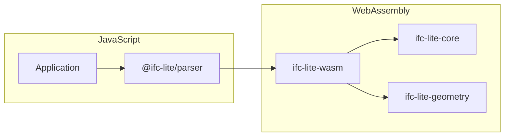

# WASM Bindings API

API documentation for the WebAssembly bindings.

## Overview

IFC-Lite provides WebAssembly bindings for high-performance parsing and geometry processing in the browser.



## Loading the WASM Module

### Automatic Loading

The TypeScript packages handle WASM loading automatically:

```typescript
import { IfcParser } from '@ifc-lite/parser';

// WASM is loaded automatically
const parser = new IfcParser();
await parser.parse(buffer);
```

### Manual Loading

For custom setups:

```typescript
import init, { IfcAPI } from 'ifc-lite-wasm';

// Initialize WASM
await init();

// Or with custom URL
await init('/path/to/ifc_lite_wasm_bg.wasm');

// Create API instance
const api = new IfcAPI();
```

## IfcAPI Class

Main entry point for WASM functionality.

### Constructor

```typescript
class IfcAPI {
  constructor();
}
```

### Methods

#### parse

Parse an IFC file from a byte array.

```typescript
parse(data: Uint8Array): ParseResult;
```

**Parameters:**
- `data` - IFC file contents as Uint8Array

**Returns:** ParseResult object with entities and metadata

**Example:**
```typescript
const api = new IfcAPI();
const buffer = await fetch('model.ifc').then(r => r.arrayBuffer());
const result = api.parse(new Uint8Array(buffer));
console.log(`Parsed ${result.entityCount} entities`);
```

#### parseStreaming

Parse with streaming for large files.

```typescript
async parseStreaming(
  data: Uint8Array,
  callback: (event: StreamEvent) => void
): Promise<ParseResult>;
```

**Parameters:**
- `data` - IFC file contents
- `callback` - Function called for each event

**Example:**
```typescript
const result = await api.parseStreaming(data, (event) => {
  if (event.type === 'progress') {
    console.log(`Progress: ${event.percent}%`);
  } else if (event.type === 'entity') {
    console.log(`Found: ${event.typeName}`);
  }
});
```

#### getEntity

Get decoded entity by express ID.

```typescript
getEntity(expressId: number): Entity | null;
```

**Parameters:**
- `expressId` - Entity express ID (#123)

**Returns:** Decoded entity or null if not found

#### getGeometry

Get triangulated geometry for an entity.

```typescript
getGeometry(expressId: number): MeshData | null;
```

**Parameters:**
- `expressId` - Entity express ID

**Returns:** Mesh data with positions, normals, indices

#### getAllMeshes

Get all processed meshes.

```typescript
getAllMeshes(): MeshData[];
```

**Returns:** Array of all mesh data

## Data Types

### ParseResult

```typescript
interface ParseResult {
  schema: string;           // IFC2X3, IFC4, IFC4X3
  entityCount: number;
  entityIndex: EntityIndex;
  header: HeaderInfo;
}
```

### Entity

```typescript
interface Entity {
  expressId: number;
  typeName: string;
  typeEnum: number;
  attributes: AttributeValue[];
}
```

### AttributeValue

```typescript
type AttributeValue =
  | { type: 'null' }
  | { type: 'int'; value: number }
  | { type: 'float'; value: number }
  | { type: 'string'; value: string }
  | { type: 'bool'; value: boolean }
  | { type: 'enum'; value: string }
  | { type: 'ref'; value: number }
  | { type: 'list'; value: AttributeValue[] };
```

### MeshData

```typescript
interface MeshData {
  expressId: number;
  positions: Float32Array;  // xyz triplets
  normals: Float32Array;    // xyz triplets
  indices: Uint32Array;     // triangle indices
  color: [number, number, number, number];
}
```

### StreamEvent

```typescript
type StreamEvent =
  | { type: 'progress'; percent: number; bytesRead: number }
  | { type: 'entity'; expressId: number; typeName: string }
  | { type: 'error'; message: string }
  | { type: 'complete' };
```

## Zero-Copy Memory Access

For optimal performance, you can access WASM memory directly:

### Getting Raw Pointers

```typescript
interface ZeroCopyBuffer {
  ptr: number;      // WASM memory pointer
  len: number;      // Buffer length in bytes
  asUint8Array(): Uint8Array;
  asFloat32Array(): Float32Array;
}

// Get positions as zero-copy view
const positions = api.getPositionsBuffer(expressId);
const view = positions.asFloat32Array();

// Upload directly to GPU
device.queue.writeBuffer(gpuBuffer, 0, view);
```

### Memory Management

```typescript
// WASM memory can be accessed directly
import { memory } from 'ifc-lite-wasm';

// Create view into WASM memory
const wasmMemory = new Uint8Array(memory.buffer);

// Views become invalid after WASM memory grows
// Always create fresh views before use
```

## Error Handling

WASM functions can throw errors:

```typescript
try {
  const result = api.parse(data);
} catch (error) {
  if (error instanceof Error) {
    console.error('Parse error:', error.message);
  }
}
```

### Error Types

| Error | Description |
|-------|-------------|
| `TokenError` | Invalid STEP syntax |
| `EntityNotFound` | Referenced entity doesn't exist |
| `UnsupportedSchema` | Unknown IFC schema version |
| `GeometryError` | Failed to process geometry |

## Performance Tips

### 1. Use Streaming for Large Files

```typescript
// Good: streaming for large files
await api.parseStreaming(largeBuffer, handleEvent);

// Avoid: loading entire file at once
api.parse(largeBuffer); // May cause memory issues
```

### 2. Batch Geometry Processing

```typescript
// Good: process in batches
const meshes = api.getAllMeshes();
for (let i = 0; i < meshes.length; i += 100) {
  const batch = meshes.slice(i, i + 100);
  await uploadBatch(batch);
}
```

### 3. Use Zero-Copy Where Possible

```typescript
// Good: zero-copy buffer view
const buffer = api.getPositionsBuffer(id);
gpuQueue.writeBuffer(vbo, 0, buffer.asFloat32Array());

// Avoid: copying to new array
const positions = new Float32Array(api.getPositions(id));
```

### 4. Release Memory

```typescript
// Clean up when done
api.free();
```

## Browser Compatibility

| Feature | Chrome | Firefox | Safari | Edge |
|---------|--------|---------|--------|------|
| WebAssembly | 57+ | 52+ | 11+ | 16+ |
| WASM SIMD | 91+ | 89+ | 16.4+ | 91+ |
| Streaming | 61+ | 58+ | 15+ | 16+ |
| Threads | 74+ | 79+ | 14.1+ | 79+ |

## Module Size

| Component | Size | Gzipped |
|-----------|------|---------|
| WASM binary | 60 KB | 20 KB |
| JS glue code | 26 KB | 8 KB |
| **Total** | **86 KB** | **28 KB** |

## Building from Source

```bash
# Install wasm-pack
cargo install wasm-pack

# Build WASM module
cd rust/wasm-bindings
wasm-pack build --target web --release

# Output files
# pkg/ifc_lite_wasm.js
# pkg/ifc_lite_wasm_bg.wasm
# pkg/ifc_lite_wasm.d.ts
```

### Build Targets

| Target | Output | Use Case |
|--------|--------|----------|
| `web` | ES modules | Modern browsers |
| `bundler` | CommonJS | Webpack/Rollup |
| `nodejs` | Node.js | Server-side |
| `no-modules` | Global | Script tag |
