# Data Flow

Detailed data flow through the IFC-Lite system.

## Complete Data Flow

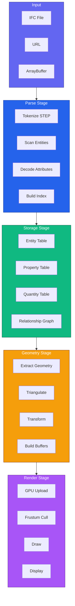

## Parsing Data Flow

### Token Flow

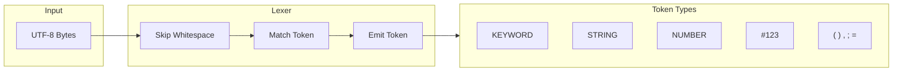

### Entity Parsing

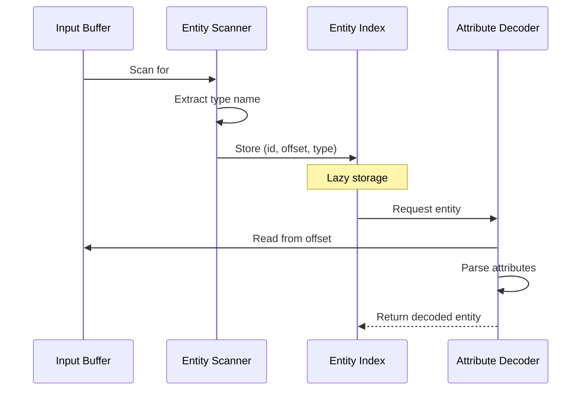

### Memory Layout

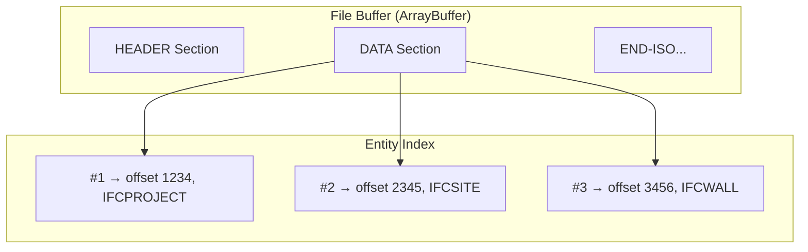

## Storage Data Flow

### Columnar Tables

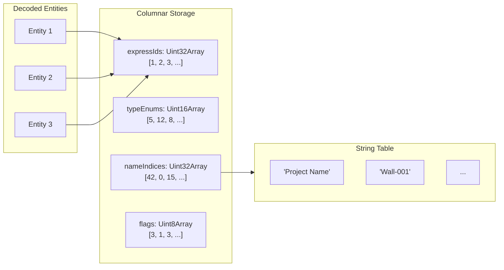

### Relationship Graph

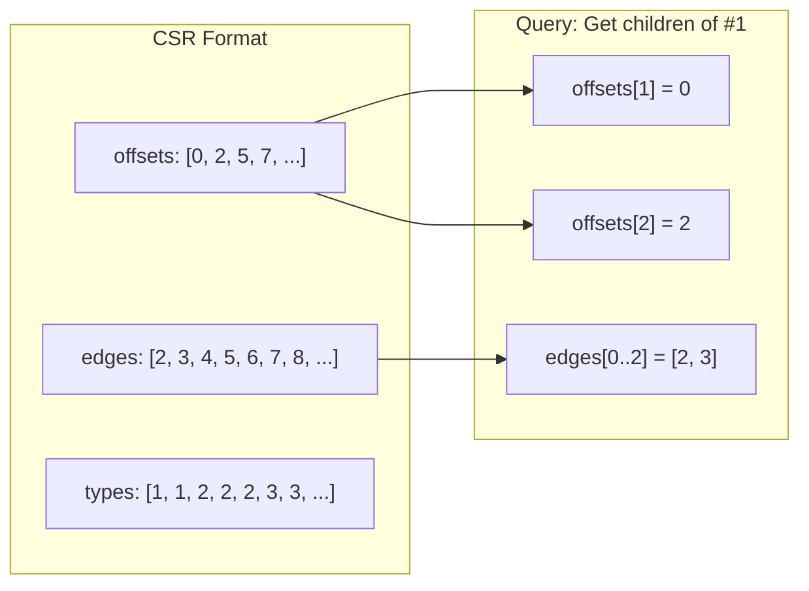

## Geometry Data Flow

### Processing Pipeline

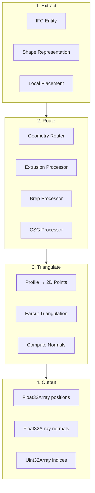

### Coordinate Transformation

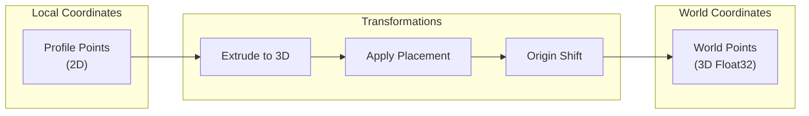

## Render Data Flow

### Buffer Upload

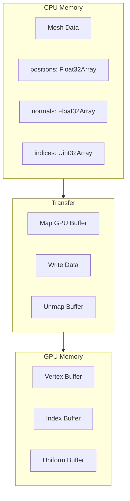

### Render Pass

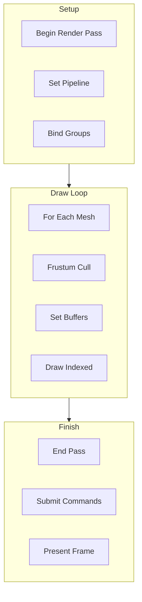

### Frame Timeline

```mermaid
gantt
    title Frame Timeline (16.67ms @ 60fps)
    dateFormat X
    axisFormat %L ms

    section CPU
    Update Camera    :a1, 0, 1
    Frustum Cull     :a2, 1, 2
    Update Uniforms  :a3, 2, 3
    Build Commands   :a4, 3, 5

    section GPU
    Vertex Shader    :b1, 5, 8
    Rasterization    :b2, 8, 12
    Fragment Shader  :b3, 12, 15
    Present          :b4, 15, 17
```

## Query Data Flow

### Fluent Query

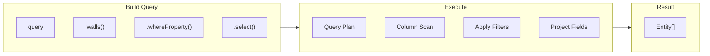

### SQL Query

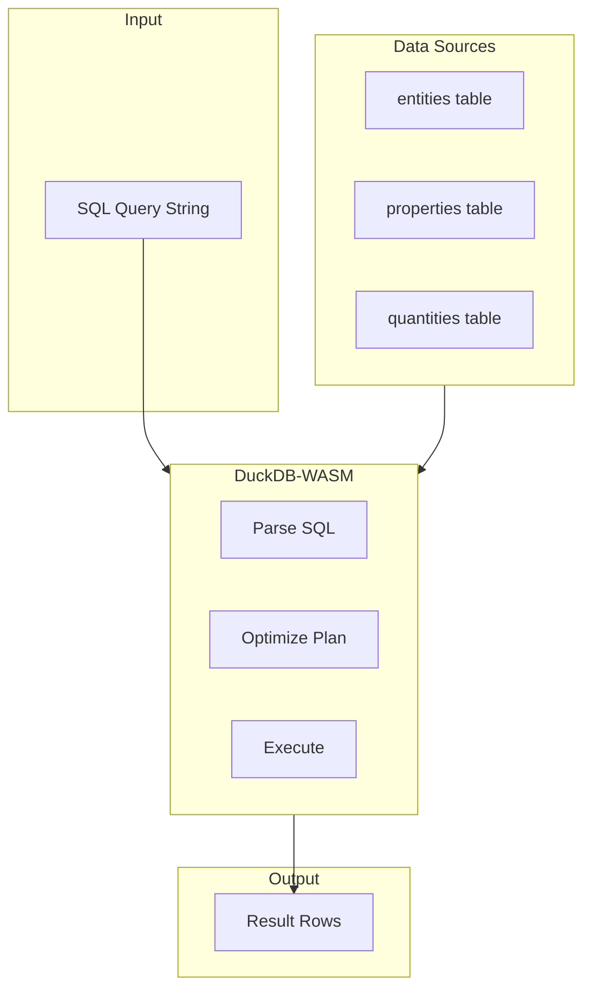

## Export Data Flow

### glTF Export

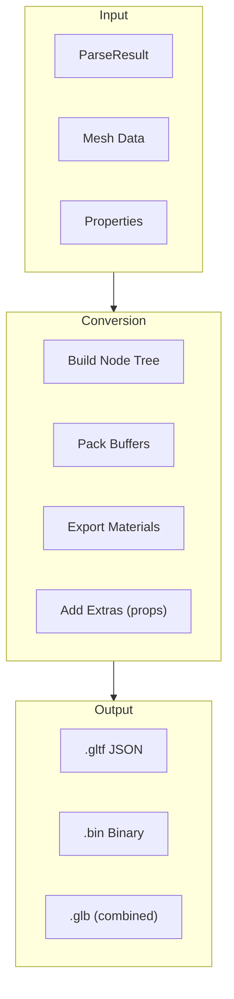

## Data Size Estimates

| Stage | Data Size (50MB IFC) | Notes |
|-------|---------------------|-------|
| File Buffer | 50 MB | Original file |
| Entity Index | ~2 MB | Just offsets + types |
| Columnar Tables | ~5 MB | Deduped, compact |
| Relationship Graph | ~1 MB | CSR format |
| Geometry Buffers | ~20 MB | Triangulated meshes |
| GPU Buffers | ~20 MB | Mirrors CPU |

## Next Steps

- [Parsing Pipeline](parsing-pipeline.md) - Parser details
- [Geometry Pipeline](geometry-pipeline.md) - Geometry details
- [Rendering Pipeline](rendering-pipeline.md) - Renderer details
