# Geometry Pipeline

Detailed architecture of geometry processing in IFC-Lite.

## Overview

The geometry pipeline transforms IFC shape representations into GPU-ready triangle meshes:

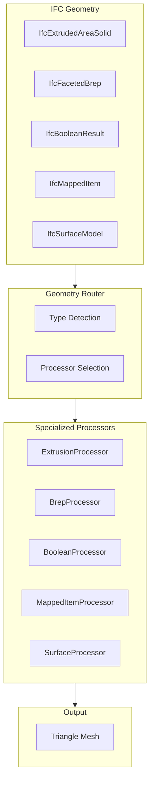

## Geometry Representation Types

### IFC Geometry Hierarchy

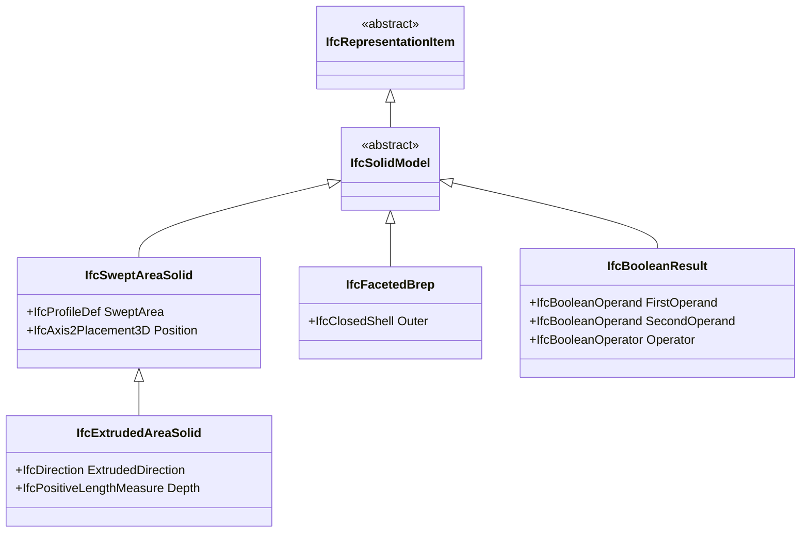

### Coverage by Type

| Geometry Type | Coverage | Notes |
|---------------|----------|-------|
| IfcExtrudedAreaSolid | Full | Most common |
| IfcFacetedBrep | Full | Pre-triangulated |
| IfcBooleanClippingResult | Partial | CSG operations |
| IfcMappedItem | Full | Instancing |
| IfcSurfaceModel | Partial | Surface meshes |
| IfcTriangulatedFaceSet | Full | IFC4 triangles |

## Extrusion Processing

### Pipeline

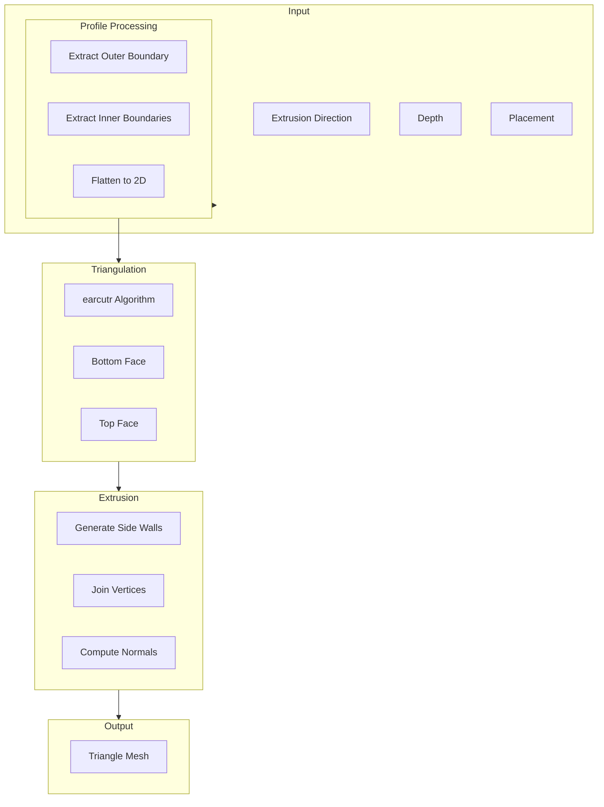

### Profile Types

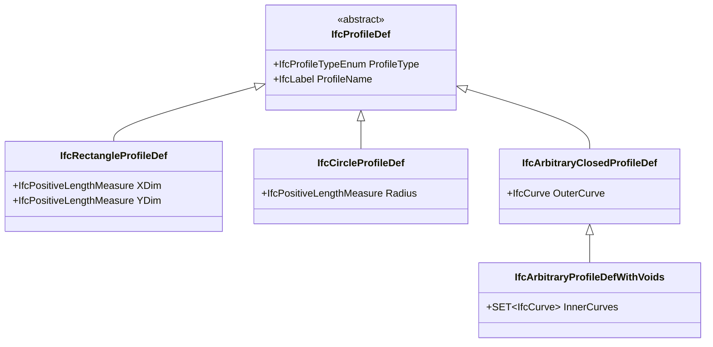

### Earcut Algorithm

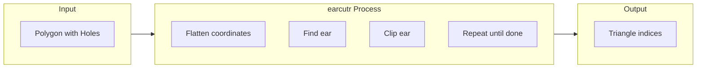

```rust
use earcutr::earcut;

fn triangulate_profile(
    outer: &[Point2],
    holes: &[Vec<Point2>]
) -> Vec<u32> {
    // Flatten to coordinate array
    let mut coords: Vec<f64> = Vec::new();
    let mut hole_indices: Vec<usize> = Vec::new();

    // Add outer boundary
    for p in outer {
        coords.push(p.x);
        coords.push(p.y);
    }

    // Add holes
    for hole in holes {
        hole_indices.push(coords.len() / 2);
        for p in hole {
            coords.push(p.x);
            coords.push(p.y);
        }
    }

    // Triangulate
    earcut(&coords, &hole_indices, 2)
        .unwrap()
        .into_iter()
        .map(|i| i as u32)
        .collect()
}
```

## Brep Processing

### FacetedBrep Pipeline

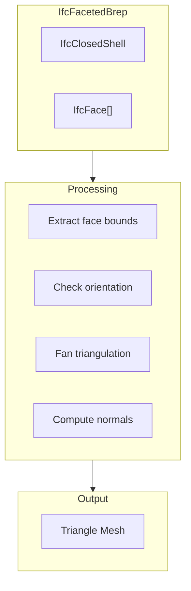

### Face Triangulation

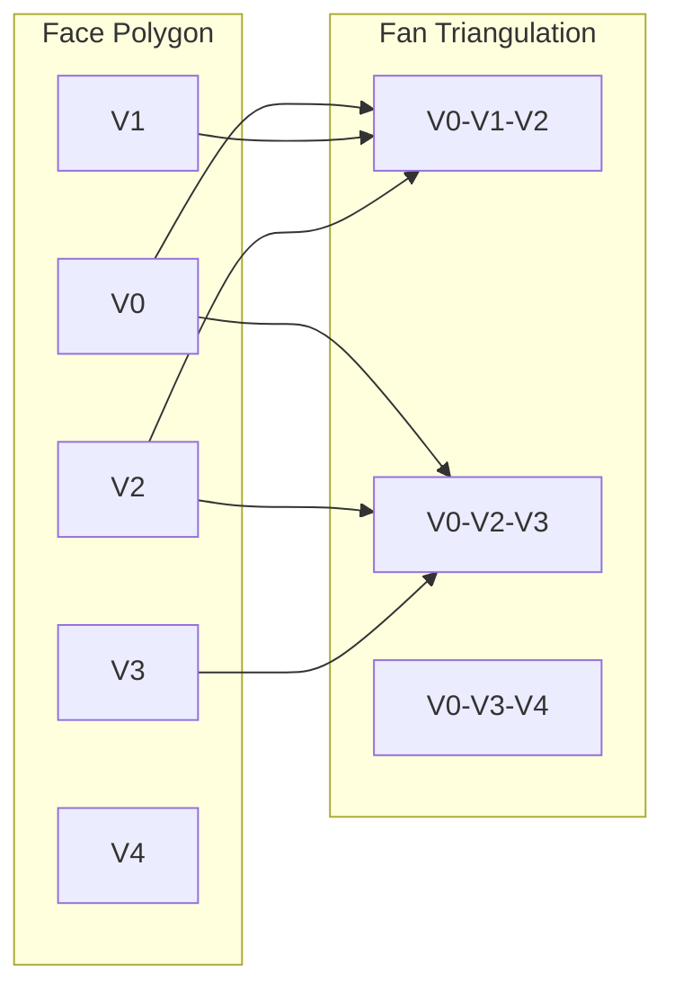

## Boolean Operations

### CSG Pipeline

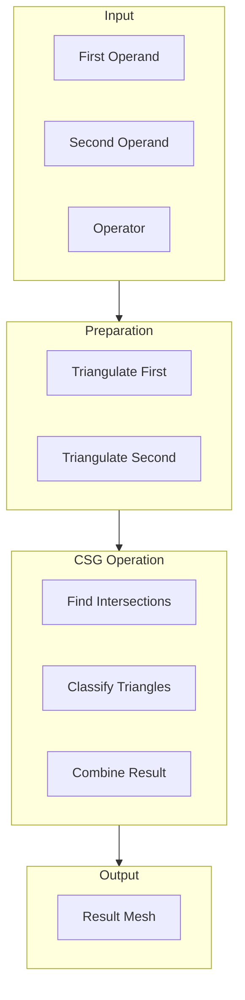

### Boolean Operators

| Operator | Description | Common Use |
|----------|-------------|------------|
| DIFFERENCE | A - B | Wall openings |
| UNION | A + B | Composite shapes |
| INTERSECTION | A ∩ B | Clipping |

## Coordinate Transformations

### Placement Stack

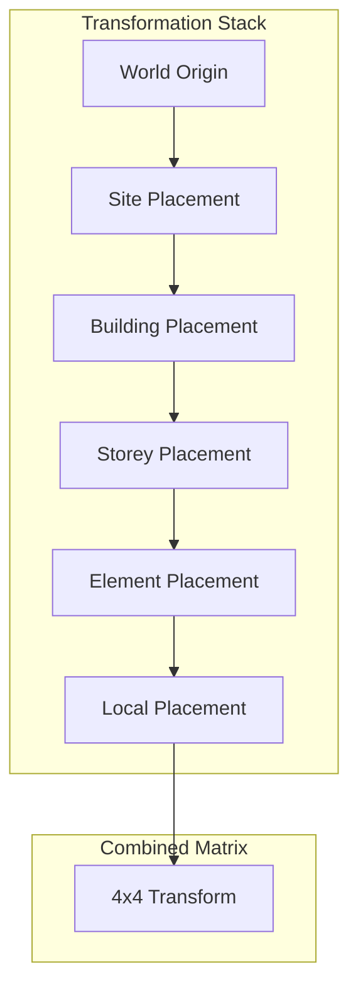

### Matrix Operations

```rust
use nalgebra::{Matrix4, Point3, Vector3};

fn compute_transform(placements: &[Placement]) -> Matrix4<f64> {
    let mut result = Matrix4::identity();

    for placement in placements {
        let local = Matrix4::new_translation(&placement.location)
            * Matrix4::from_axis_angle(&placement.axis, placement.angle);
        result = result * local;
    end

    result
}

fn transform_point(point: Point3<f64>, matrix: &Matrix4<f64>) -> Point3<f64> {
    matrix.transform_point(&point)
}
```

### Large Coordinate Handling

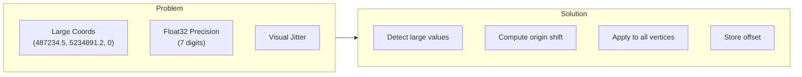

```typescript
function computeOriginShift(bounds: BoundingBox): Vector3 {
  const threshold = 10000; // Shift if > 10km from origin

  if (Math.abs(bounds.center.x) > threshold ||
      Math.abs(bounds.center.y) > threshold) {
    return {
      x: -bounds.center.x,
      y: -bounds.center.y,
      z: 0
    };
  }

  return { x: 0, y: 0, z: 0 };
}
```

## Quality Modes

### Curve Discretization

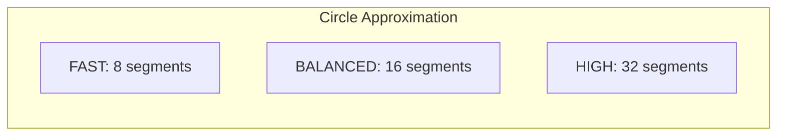

| Mode | Segments | Triangles | Use Case |
|------|----------|-----------|----------|
| FAST | 8 | Fewer | Mobile, preview |
| BALANCED | 16 | Medium | Default |
| HIGH | 32 | More | Detailed viewing |

## Instancing

### MappedItem Processing

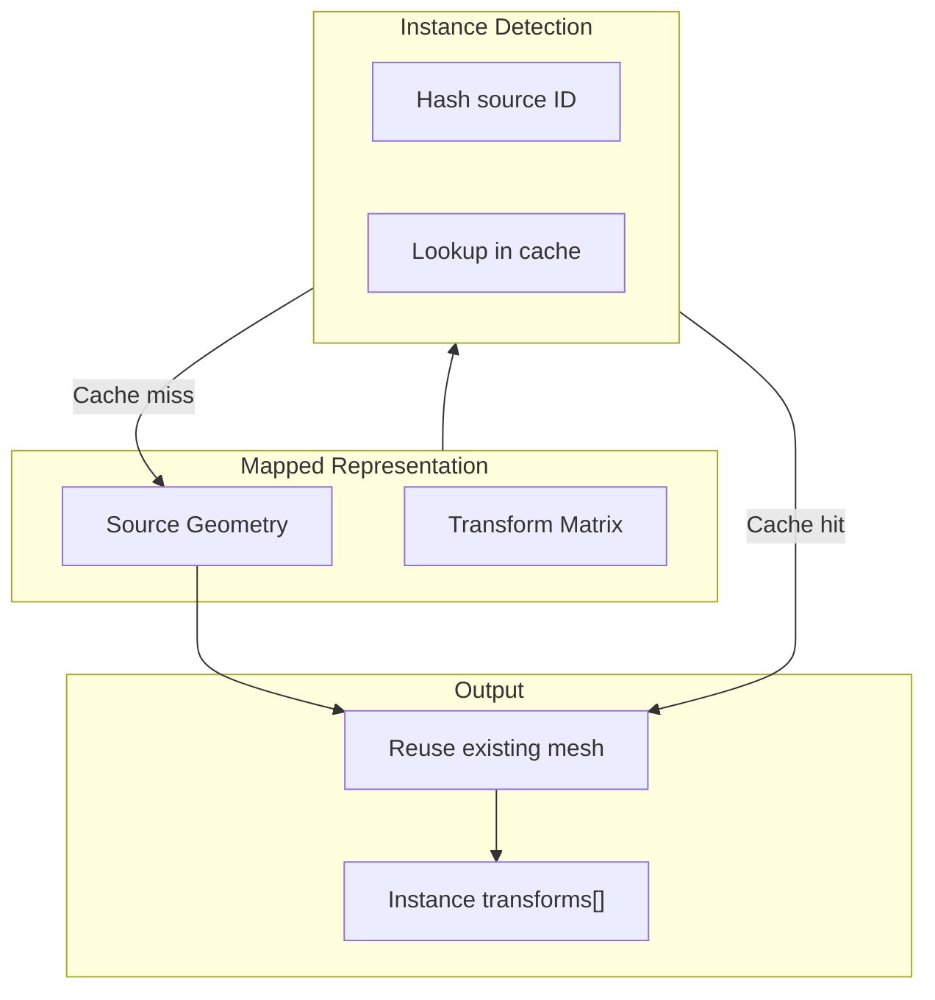

### Instance Data Structure

```typescript
interface InstancedMesh {
  baseMesh: Mesh;
  transforms: Matrix4[];
  expressIds: number[];
}

// GPU instancing data
interface InstanceData {
  positions: Float32Array;    // Shared geometry
  normals: Float32Array;
  indices: Uint32Array;
  instanceMatrices: Float32Array;  // Per-instance transforms
  instanceColors: Float32Array;    // Per-instance colors
}
```

## Streaming Pipeline

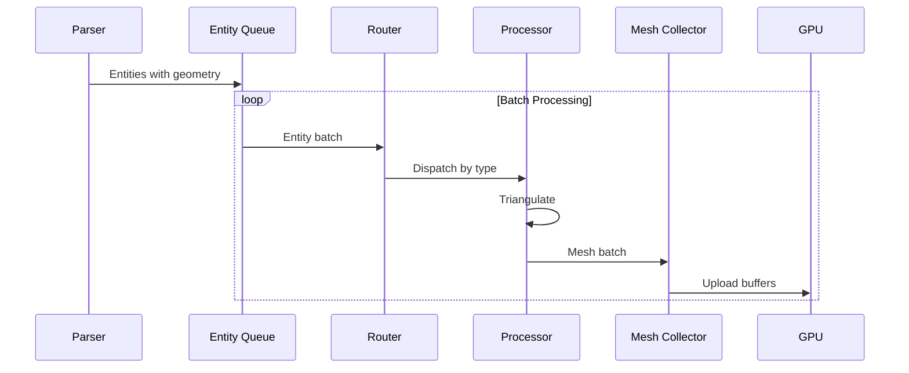

### Batch Processing

```typescript
async function processGeometryBatches(
  entities: Entity[],
  batchSize: number,
  onBatch: (batch: MeshBatch) => Promise<void>
): Promise<void> {
  const geoEntities = entities.filter(e => e.hasGeometry);

  for (let i = 0; i < geoEntities.length; i += batchSize) {
    const batch = geoEntities.slice(i, i + batchSize);
    const meshes = await Promise.all(
      batch.map(e => processEntity(e))
    );

    await onBatch({
      meshes,
      bounds: computeBounds(meshes),
      progress: (i + batch.length) / geoEntities.length
    });
  }
}
```

## Performance Metrics

| Operation | Time (typical) | Notes |
|-----------|---------------|-------|
| Profile extraction | 0.1 ms | Per entity |
| Earcut triangulation | 0.5 ms | Simple profile |
| Extrusion | 0.2 ms | Per entity |
| Boolean operation | 5-50 ms | Complex |
| Transform application | 0.01 ms | Per vertex |

### Throughput

- **Simple extrusions**: ~2000 entities/sec
- **Complex Breps**: ~200 entities/sec
- **Boolean operations**: ~20 entities/sec

## Next Steps

- [Rendering Pipeline](rendering-pipeline.md) - WebGPU rendering
- [API Reference](../api/rust.md) - Geometry API
