# Parsing Pipeline

Detailed architecture of the IFC-Lite parsing system.

## Overview

The parsing pipeline transforms STEP/IFC files into structured data:

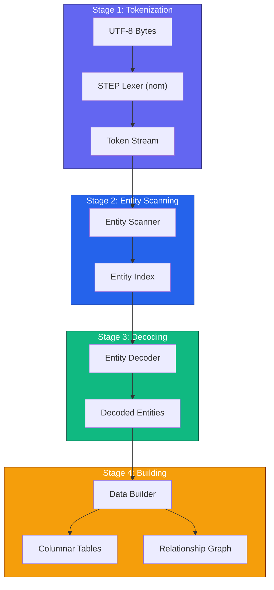

## Stage 1: Tokenization

### Token Types

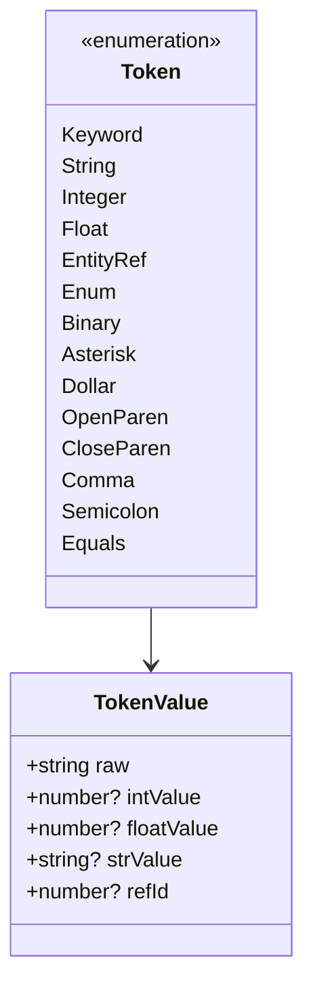

### Lexer Architecture

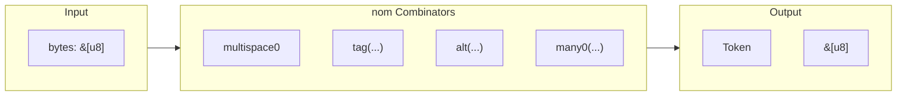

### Key Lexer Functions

```rust
// Entity reference: #123
fn entity_ref(input: &[u8]) -> IResult<&[u8], Token> {
    let (input, _) = tag(b"#")(input)?;
    let (input, num) = digit1(input)?;
    let id = parse_u32(num)?;
    Ok((input, Token::EntityRef(id)))
}

// String literal: 'Hello World'
fn string_literal(input: &[u8]) -> IResult<&[u8], Token> {
    let (input, _) = tag(b"'")(input)?;
    let (input, content) = take_until("'")(input)?;
    let (input, _) = tag(b"'")(input)?;
    Ok((input, Token::String(content)))
}

// Keyword: IFCWALL
fn keyword(input: &[u8]) -> IResult<&[u8], Token> {
    let (input, word) = alpha1(input)?;
    Ok((input, Token::Keyword(word)))
}
```

### Performance Optimizations

| Optimization | Technique | Benefit |
|--------------|-----------|---------|
| Zero-copy | Store byte slices | No allocation |
| SIMD search | memchr crate | 10x faster search |
| Fast numbers | lexical-core | 5x faster parsing |
| Branch prediction | Ordered alternatives | Better CPU prediction |

## Stage 2: Entity Scanning

### Scanner State Machine

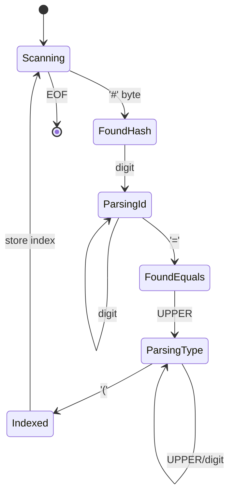

### Entity Index Structure

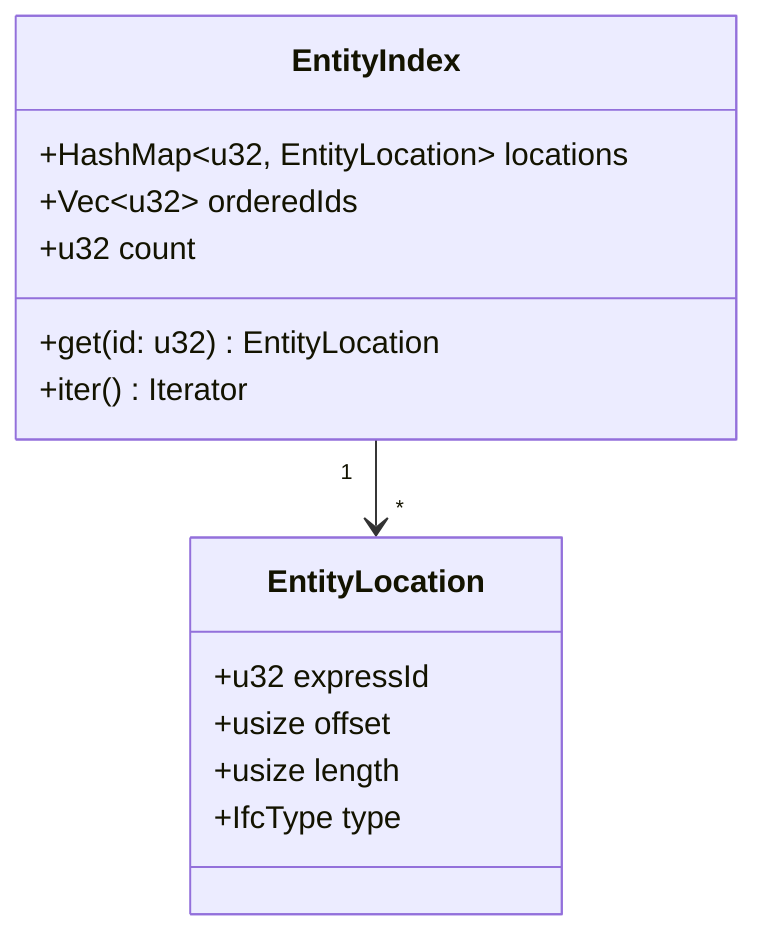

### Scanning Algorithm

```rust
pub fn scan_entities(input: &[u8]) -> EntityIndex {
    let mut index = EntityIndex::new();
    let mut pos = 0;

    while pos < input.len() {
        // Find next entity marker
        if let Some(hash_pos) = memchr(b'#', &input[pos..]) {
            pos += hash_pos;

            // Parse entity ID
            let (id, id_end) = parse_entity_id(&input[pos..]);

            // Find '=' and type name
            if let Some(type_start) = find_type_start(&input[pos + id_end..]) {
                let type_name = extract_type_name(&input[pos + id_end + type_start..]);

                // Store location
                index.insert(id, EntityLocation {
                    expressId: id,
                    offset: pos,
                    type: IfcType::from_name(type_name),
                });
            }

            pos += 1;
        } else {
            break;
        }
    }

    index
}
```

## Stage 3: Entity Decoding

### Decoder Architecture

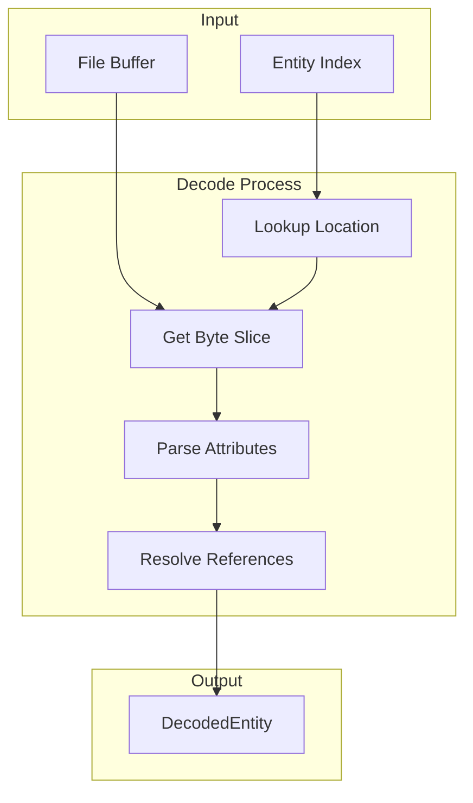

### Lazy vs Eager Decoding

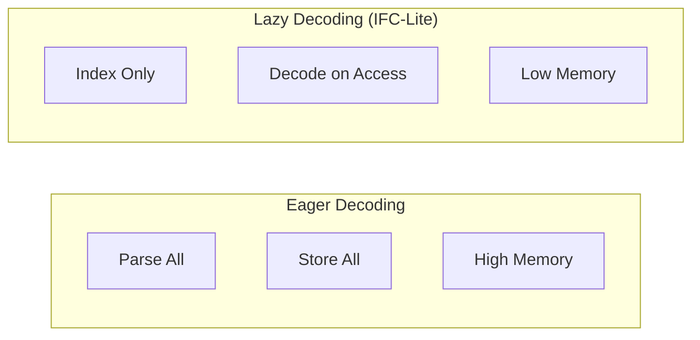

### Attribute Value Types

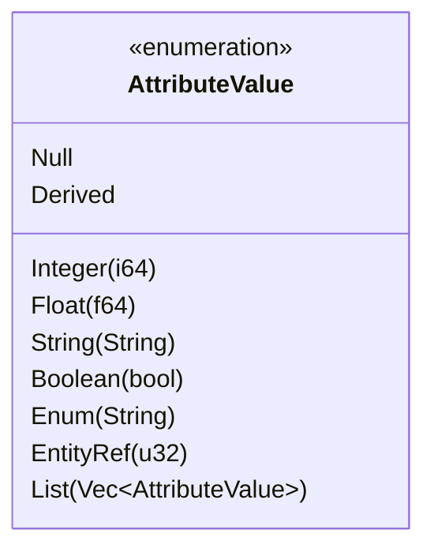

## Stage 4: Data Building

### Builder Pipeline

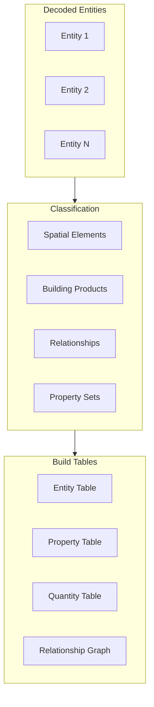

### Columnar Table Building

```rust
pub struct EntityTableBuilder {
    express_ids: Vec<u32>,
    type_enums: Vec<u16>,
    global_id_indices: Vec<u32>,
    name_indices: Vec<u32>,
    flags: Vec<u8>,
}

impl EntityTableBuilder {
    pub fn add(&mut self, entity: &DecodedEntity, strings: &mut StringTable) {
        self.express_ids.push(entity.express_id);
        self.type_enums.push(entity.type_enum);
        self.global_id_indices.push(
            strings.intern(&entity.global_id)
        );
        self.name_indices.push(
            entity.name.map(|n| strings.intern(n)).unwrap_or(0)
        );
        self.flags.push(entity.compute_flags());
    }

    pub fn build(self) -> EntityTable {
        EntityTable {
            express_ids: Uint32Array::from(self.express_ids),
            type_enums: Uint16Array::from(self.type_enums),
            // ...
        }
    }
}
```

### Relationship Graph Building

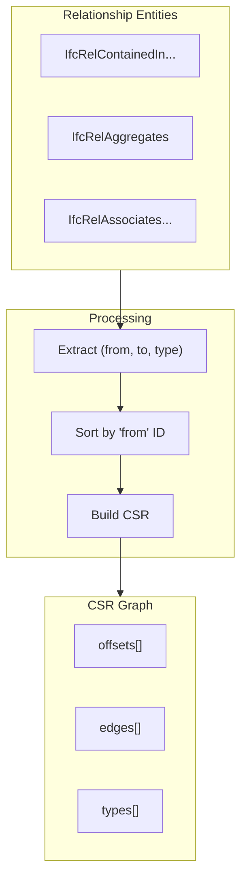

## Streaming Architecture

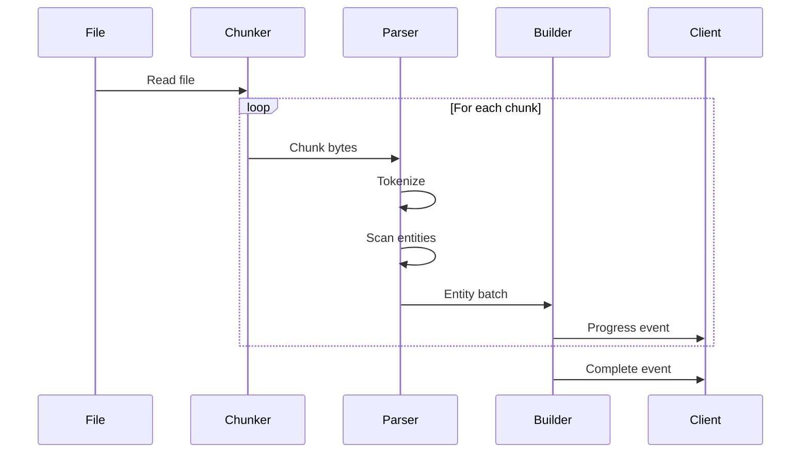

### Chunk Processing

```typescript
interface StreamConfig {
  chunkSize: number;      // Bytes per chunk (default: 1MB)
  batchSize: number;      // Entities per batch (default: 100)
  onProgress: (p: Progress) => void;
  onBatch: (b: EntityBatch) => void;
}

async function parseStreaming(
  buffer: ArrayBuffer,
  config: StreamConfig
): Promise<ParseResult> {
  const totalSize = buffer.byteLength;
  let offset = 0;

  while (offset < totalSize) {
    const chunk = buffer.slice(offset, offset + config.chunkSize);
    const entities = await parseChunk(chunk);

    config.onBatch({ entities });
    config.onProgress({ percent: (offset / totalSize) * 100 });

    offset += config.chunkSize;
  }
}
```

## Error Handling

### Error Types

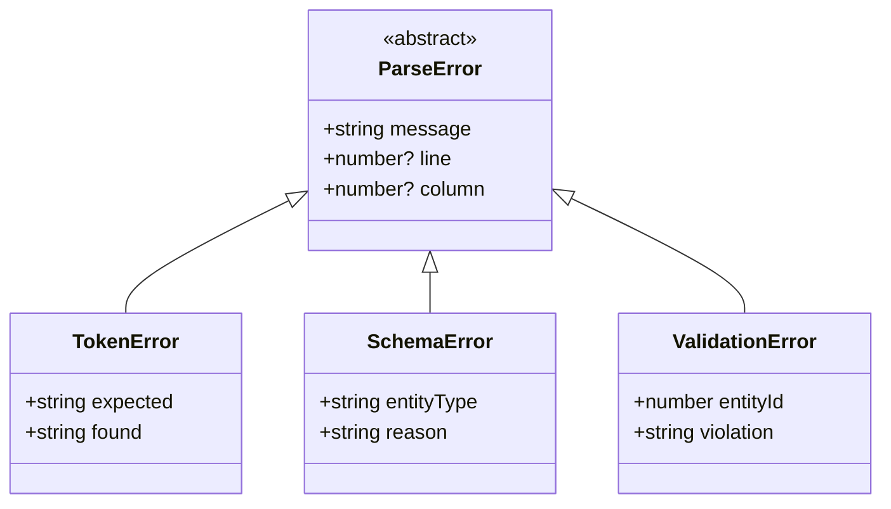

### Error Recovery

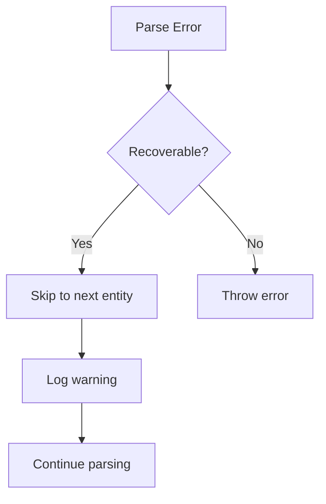

## Performance Metrics

| File Size | Tokenize | Scan | Decode | Build | Total |
|-----------|----------|------|--------|-------|-------|
| 10 MB | 8ms | 15ms | 200ms | 50ms | ~300ms |
| 50 MB | 40ms | 75ms | 800ms | 200ms | ~1.1s |
| 100 MB | 80ms | 150ms | 1.5s | 400ms | ~2.1s |

### Throughput

- **Tokenization**: ~1,259 MB/s
- **Entity scanning**: ~650 MB/s
- **Full parsing**: ~50 MB/s

## Next Steps

- [Geometry Pipeline](geometry-pipeline.md) - Geometry processing
- [Rendering Pipeline](rendering-pipeline.md) - WebGPU rendering
- [API Reference](../api/rust.md) - Parser API
