# Rendering Pipeline

Detailed architecture of the WebGPU rendering system.

## Overview

The rendering pipeline transforms mesh data into pixels on screen:

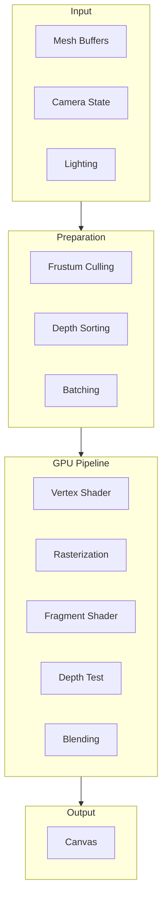

## WebGPU Architecture

### Device Initialization

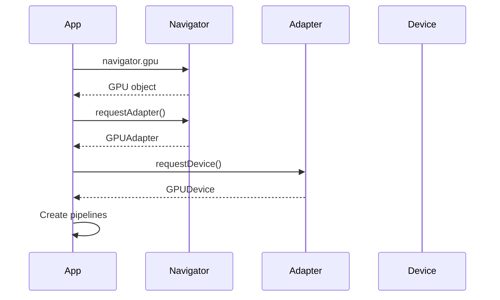

### Resource Hierarchy

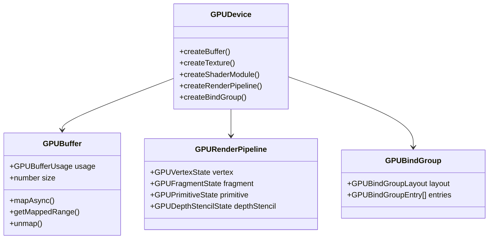

## Buffer Management

### Buffer Types

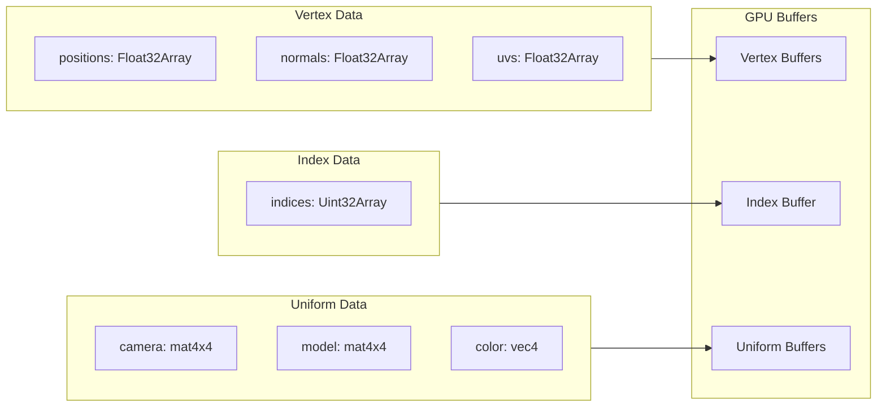

### Buffer Layout

```typescript
// Vertex buffer layout
const vertexBufferLayout: GPUVertexBufferLayout = {
  arrayStride: 24, // 6 floats * 4 bytes
  attributes: [
    {
      // Position
      shaderLocation: 0,
      offset: 0,
      format: 'float32x3'
    },
    {
      // Normal
      shaderLocation: 1,
      offset: 12,
      format: 'float32x3'
    }
  ]
};

// Interleaved vertex data
// [px, py, pz, nx, ny, nz, px, py, pz, nx, ny, nz, ...]
```

## Shader Architecture

### Vertex Shader

```wgsl
struct Uniforms {
    viewProjection: mat4x4<f32>,
    model: mat4x4<f32>,
    normalMatrix: mat3x3<f32>,
}

struct VertexInput {
    @location(0) position: vec3<f32>,
    @location(1) normal: vec3<f32>,
}

struct VertexOutput {
    @builtin(position) position: vec4<f32>,
    @location(0) worldPos: vec3<f32>,
    @location(1) normal: vec3<f32>,
}

@group(0) @binding(0) var<uniform> uniforms: Uniforms;

@vertex
fn main(input: VertexInput) -> VertexOutput {
    var output: VertexOutput;

    let worldPos = uniforms.model * vec4(input.position, 1.0);
    output.position = uniforms.viewProjection * worldPos;
    output.worldPos = worldPos.xyz;
    output.normal = uniforms.normalMatrix * input.normal;

    return output;
}
```

### Fragment Shader

```wgsl
struct Material {
    color: vec4<f32>,
    metallic: f32,
    roughness: f32,
}

struct Light {
    position: vec3<f32>,
    color: vec3<f32>,
    intensity: f32,
}

@group(0) @binding(1) var<uniform> material: Material;
@group(0) @binding(2) var<uniform> light: Light;

@fragment
fn main(input: VertexOutput) -> @location(0) vec4<f32> {
    let N = normalize(input.normal);
    let L = normalize(light.position - input.worldPos);
    let V = normalize(-input.worldPos);
    let H = normalize(L + V);

    // Diffuse
    let NdotL = max(dot(N, L), 0.0);
    let diffuse = material.color.rgb * NdotL;

    // Specular (Blinn-Phong)
    let NdotH = max(dot(N, H), 0.0);
    let specular = pow(NdotH, 32.0) * (1.0 - material.roughness);

    // Ambient
    let ambient = material.color.rgb * 0.1;

    let finalColor = ambient + diffuse + specular * light.color;
    return vec4(finalColor, material.color.a);
}
```

## Render Loop

### Frame Structure

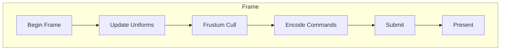

### Command Encoding

```typescript
render(): void {
  // Begin frame
  const commandEncoder = device.createCommandEncoder();

  const renderPass = commandEncoder.beginRenderPass({
    colorAttachments: [{
      view: context.getCurrentTexture().createView(),
      clearValue: { r: 0.95, g: 0.95, b: 0.95, a: 1.0 },
      loadOp: 'clear',
      storeOp: 'store'
    }],
    depthStencilAttachment: {
      view: depthTexture.createView(),
      depthClearValue: 1.0,
      depthLoadOp: 'clear',
      depthStoreOp: 'store'
    }
  });

  // Set pipeline
  renderPass.setPipeline(renderPipeline);

  // Draw meshes
  for (const mesh of visibleMeshes) {
    renderPass.setBindGroup(0, mesh.bindGroup);
    renderPass.setVertexBuffer(0, mesh.vertexBuffer);
    renderPass.setIndexBuffer(mesh.indexBuffer, 'uint32');
    renderPass.drawIndexed(mesh.indexCount);
  }

  renderPass.end();

  // Submit
  device.queue.submit([commandEncoder.finish()]);
}
```

## Frustum Culling

### Culling Pipeline

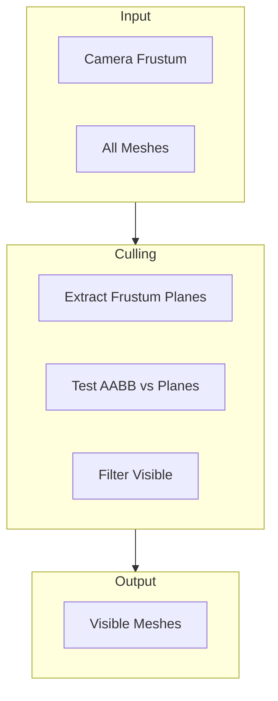

### AABB-Frustum Test

```typescript
interface Frustum {
  planes: Plane[]; // 6 planes: near, far, left, right, top, bottom
}

interface AABB {
  min: Vector3;
  max: Vector3;
}

function isVisible(aabb: AABB, frustum: Frustum): boolean {
  for (const plane of frustum.planes) {
    // Get positive vertex (furthest along plane normal)
    const pVertex = {
      x: plane.normal.x > 0 ? aabb.max.x : aabb.min.x,
      y: plane.normal.y > 0 ? aabb.max.y : aabb.min.y,
      z: plane.normal.z > 0 ? aabb.max.z : aabb.min.z
    };

    // If positive vertex is behind plane, AABB is outside
    if (dot(plane.normal, pVertex) + plane.d < 0) {
      return false;
    }
  }
  return true;
}
```

## Selection & Picking

### ID Buffer Approach

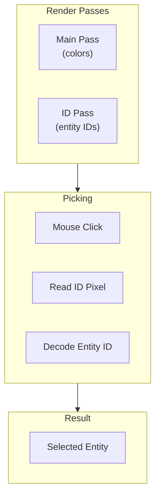

### ID Encoding

```wgsl
// ID buffer fragment shader
@fragment
fn main_id(@location(0) entityId: u32) -> @location(0) vec4<u32> {
    // Encode entity ID as RGBA
    return vec4<u32>(
        entityId & 0xFF,
        (entityId >> 8) & 0xFF,
        (entityId >> 16) & 0xFF,
        (entityId >> 24) & 0xFF
    );
}
```

```typescript
async function pick(x: number, y: number): Promise<number | null> {
  // Render ID buffer
  await renderIdBuffer();

  // Read pixel
  const buffer = device.createBuffer({
    size: 4,
    usage: GPUBufferUsage.MAP_READ | GPUBufferUsage.COPY_DST
  });

  commandEncoder.copyTextureToBuffer(
    { texture: idTexture, origin: { x, y, z: 0 } },
    { buffer, bytesPerRow: 256 },
    { width: 1, height: 1, depthOrArrayLayers: 1 }
  );

  await buffer.mapAsync(GPUMapMode.READ);
  const data = new Uint8Array(buffer.getMappedRange());

  // Decode entity ID
  const entityId = data[0] | (data[1] << 8) | (data[2] << 16) | (data[3] << 24);

  buffer.unmap();
  return entityId > 0 ? entityId : null;
}
```

## Section Planes

### Clipping Implementation

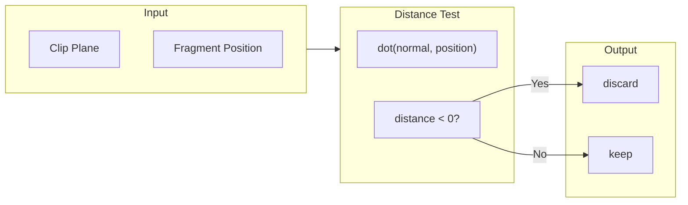

### Section Shader

```wgsl
struct SectionPlane {
    point: vec3<f32>,
    normal: vec3<f32>,
    enabled: u32,
}

@group(1) @binding(0) var<uniform> sectionPlane: SectionPlane;

@fragment
fn main(input: VertexOutput) -> @location(0) vec4<f32> {
    // Clip against section plane
    if (sectionPlane.enabled != 0u) {
        let distance = dot(sectionPlane.normal, input.worldPos - sectionPlane.point);
        if (distance < 0.0) {
            discard;
        }
    }

    // Normal shading...
    return color;
}
```

## Transparency

### Order-Independent Transparency

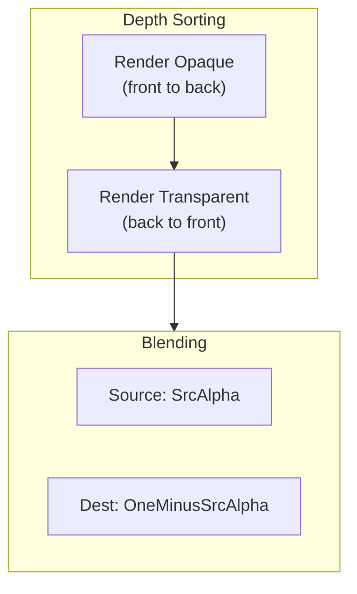

### Blend State

```typescript
const transparentPipeline = device.createRenderPipeline({
  // ...
  fragment: {
    targets: [{
      format: 'bgra8unorm',
      blend: {
        color: {
          srcFactor: 'src-alpha',
          dstFactor: 'one-minus-src-alpha',
          operation: 'add'
        },
        alpha: {
          srcFactor: 'one',
          dstFactor: 'one-minus-src-alpha',
          operation: 'add'
        }
      }
    }]
  }
});
```

## Performance Optimization

### Batching Strategy

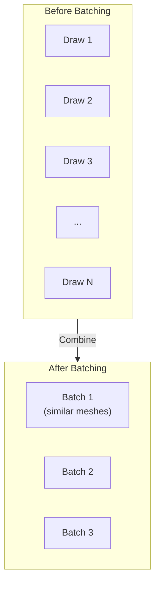

### Instancing

```typescript
// Instance buffer layout
const instanceBufferLayout: GPUVertexBufferLayout = {
  arrayStride: 80, // mat4 (64) + color (16)
  stepMode: 'instance',
  attributes: [
    { shaderLocation: 2, offset: 0, format: 'float32x4' },
    { shaderLocation: 3, offset: 16, format: 'float32x4' },
    { shaderLocation: 4, offset: 32, format: 'float32x4' },
    { shaderLocation: 5, offset: 48, format: 'float32x4' },
    { shaderLocation: 6, offset: 64, format: 'float32x4' }
  ]
};

// Draw instanced
renderPass.drawIndexed(indexCount, instanceCount);
```

## Frame Statistics

```mermaid
gantt
    title Frame Timeline (60 FPS = 16.67ms)
    dateFormat X
    axisFormat %Lms

    section CPU
    Update Camera     :a1, 0, 1
    Frustum Cull      :a2, 1, 2
    Sort Transparent  :a3, 2, 3
    Encode Commands   :a4, 3, 5

    section GPU
    Vertex Processing :b1, 5, 8
    Rasterization     :b2, 8, 11
    Fragment Processing :b3, 11, 14
    Present           :b4, 14, 17
```

### Performance Metrics

| Metric | Target | Notes |
|--------|--------|-------|
| FPS | 60 | Minimum for smooth |
| Draw calls | < 1000 | Per frame |
| Triangles | < 5M | Visible |
| GPU memory | < 512 MB | Total |

## Next Steps

- [Overview](overview.md) - System architecture
- [API Reference](../api/typescript.md) - Renderer API
