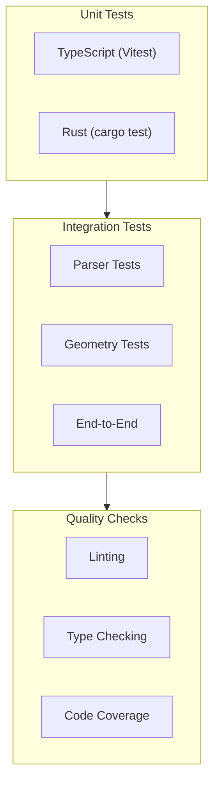

# Testing

Guide to testing IFC-Lite.

## Overview



## Running Tests

### All Tests

```bash
# Run all tests
pnpm test

# Run with coverage
pnpm test:coverage
```

### TypeScript Tests

```bash
# Run all TypeScript tests
pnpm -r test

# Run specific package
cd packages/parser && pnpm test

# Watch mode
cd packages/parser && pnpm test:watch

# With coverage
cd packages/parser && pnpm test:coverage
```

### Rust Tests

```bash
# Run all Rust tests
cd rust && cargo test

# Run specific crate
cd rust/core && cargo test

# Run specific test
cargo test parse_entity

# With output
cargo test -- --nocapture
```

## Writing Tests

### TypeScript Tests (Vitest)

```typescript
// src/__tests__/parser.test.ts
import { describe, it, expect, beforeEach } from 'vitest';
import { IfcParser } from '../parser';

describe('IfcParser', () => {
  let parser: IfcParser;

  beforeEach(() => {
    parser = new IfcParser();
  });

  describe('parse', () => {
    it('should parse a simple IFC file', async () => {
      const content = `
        ISO-10303-21;
        HEADER;
        FILE_DESCRIPTION((''), '2;1');
        FILE_NAME('test.ifc', '', '', '', '', '', '');
        FILE_SCHEMA(('IFC4'));
        ENDSEC;
        DATA;
        #1=IFCPROJECT('0001',#2,$,$,$,$,$,$,$);
        ENDSEC;
        END-ISO-10303-21;
      `;

      const buffer = new TextEncoder().encode(content).buffer;
      const result = await parser.parse(buffer);

      expect(result.entityCount).toBe(1);
      expect(result.schema).toBe('IFC4');
    });

    it('should extract entity properties', async () => {
      const buffer = await loadTestFile('test-model.ifc');
      const result = await parser.parse(buffer);

      const wall = result.entities.find(e => e.type === 'IFCWALL');
      expect(wall).toBeDefined();
      expect(wall?.globalId).toMatch(/^[0-9a-zA-Z_$]+$/);
    });

    it('should handle streaming parse', async () => {
      const buffer = await loadTestFile('large-model.ifc');
      const batches: number[] = [];

      await parser.parseStreaming(buffer, {
        batchSize: 100,
        onBatch: (batch) => {
          batches.push(batch.entities.length);
        }
      });

      expect(batches.length).toBeGreaterThan(0);
      expect(batches.reduce((a, b) => a + b, 0)).toBeGreaterThan(0);
    });

    it('should throw on invalid file', async () => {
      const buffer = new TextEncoder().encode('invalid content').buffer;

      await expect(parser.parse(buffer)).rejects.toThrow();
    });
  });
});
```

### Rust Tests

```rust
// src/parser/tests.rs
use super::*;

#[cfg(test)]
mod tests {
    use super::*;

    #[test]
    fn test_parse_entity_ref() {
        let input = b"#123=";
        let (_, token) = entity_ref(input).unwrap();

        assert_eq!(token, Token::EntityRef(123));
    }

    #[test]
    fn test_parse_string_literal() {
        let input = b"'Hello World'";
        let (_, token) = string_literal(input).unwrap();

        assert_eq!(token, Token::String(b"Hello World"));
    }

    #[test]
    fn test_parse_entity() {
        let input = b"#1=IFCWALL('guid',$,$,$,$,$,$,$);";
        let (id, type_name, attrs) = parse_entity(input).unwrap();

        assert_eq!(id, 1);
        assert_eq!(type_name, b"IFCWALL");
        assert_eq!(attrs.len(), 8);
    }

    #[test]
    fn test_entity_scanner() {
        let input = b"DATA;\n#1=IFCPROJECT();\n#2=IFCSITE();\nENDSEC;";
        let mut scanner = EntityScanner::new();
        let index = scanner.scan(input).unwrap();

        assert_eq!(index.len(), 2);
        assert!(index.get(1).is_some());
        assert!(index.get(2).is_some());
    }

    #[test]
    fn test_decode_entity() {
        let input = include_bytes!("../../test-data/simple.ifc");
        let scanner = EntityScanner::new();
        let index = scanner.scan(input).unwrap();
        let decoder = EntityDecoder::new(input, &index);

        let entity = decoder.decode(1).unwrap();
        assert_eq!(entity.ifc_type, IfcType::IfcProject);
    }

    #[test]
    #[should_panic(expected = "EntityNotFound")]
    fn test_decode_missing_entity() {
        let input = b"DATA;\n#1=IFCPROJECT();\nENDSEC;";
        let scanner = EntityScanner::new();
        let index = scanner.scan(input).unwrap();
        let decoder = EntityDecoder::new(input, &index);

        decoder.decode(999).unwrap(); // Should panic
    }
}
```

### Integration Tests

```typescript
// tests/integration/full-parse.test.ts
import { describe, it, expect } from 'vitest';
import { IfcParser } from '@ifc-lite/parser';
import { Renderer } from '@ifc-lite/renderer';
import { readFileSync } from 'fs';
import { join } from 'path';

describe('Full Parse Integration', () => {
  it('should parse and render a real IFC file', async () => {
    // Load test file
    const filePath = join(__dirname, '../fixtures/test-model.ifc');
    const buffer = readFileSync(filePath).buffer;

    // Parse
    const parser = new IfcParser();
    const result = await parser.parse(buffer);

    // Verify parsing
    expect(result.entityCount).toBeGreaterThan(0);
    expect(result.geometry.meshes.length).toBeGreaterThan(0);

    // Verify geometry
    const mesh = result.geometry.meshes[0];
    expect(mesh.positions.length).toBeGreaterThan(0);
    expect(mesh.indices.length).toBeGreaterThan(0);
    expect(mesh.indices.length % 3).toBe(0); // Valid triangles
  });

  it('should handle large files with streaming', async () => {
    const filePath = join(__dirname, '../fixtures/large-model.ifc');
    const buffer = readFileSync(filePath).buffer;

    const parser = new IfcParser();
    let totalEntities = 0;

    const result = await parser.parseStreaming(buffer, {
      batchSize: 100,
      onBatch: (batch) => {
        totalEntities += batch.entities.length;
      }
    });

    expect(result.entityCount).toBe(totalEntities);
  });
});
```

## Test Fixtures

### Location

```
tests/
├── fixtures/
│   ├── simple.ifc           # Minimal IFC file
│   ├── test-model.ifc       # Standard test model
│   ├── large-model.ifc      # Large file for performance
│   └── edge-cases/
│       ├── unicode.ifc      # Unicode strings
│       ├── empty.ifc        # Empty DATA section
│       └── nested.ifc       # Deeply nested entities
```

### Creating Test Data

```typescript
// tests/helpers/create-fixture.ts
export function createMinimalIfc(entities: string[]): ArrayBuffer {
  const content = `
ISO-10303-21;
HEADER;
FILE_DESCRIPTION(('Test'), '2;1');
FILE_NAME('test.ifc', '', '', '', '', '', '');
FILE_SCHEMA(('IFC4'));
ENDSEC;
DATA;
${entities.join('\n')}
ENDSEC;
END-ISO-10303-21;
  `;
  return new TextEncoder().encode(content).buffer;
}

// Usage
const buffer = createMinimalIfc([
  "#1=IFCPROJECT('proj123',$,$,$,$,$,$,$,$);",
  "#2=IFCWALL('wall123',$,$,$,$,$,$,$);"
]);
```

## Mocking

### TypeScript Mocks

```typescript
import { vi, describe, it, expect } from 'vitest';

// Mock WASM module
vi.mock('@ifc-lite/wasm', () => ({
  IfcAPI: class MockIfcAPI {
    parse() {
      return { entityCount: 10 };
    }
  }
}));

// Mock fetch
vi.stubGlobal('fetch', vi.fn(() =>
  Promise.resolve({
    arrayBuffer: () => Promise.resolve(new ArrayBuffer(0))
  })
));
```

### Rust Mocks

```rust
#[cfg(test)]
mod tests {
    use super::*;
    use mockall::predicate::*;
    use mockall::*;

    mock! {
        pub Decoder {
            fn decode(&self, id: u32) -> Result<Entity, Error>;
        }
    }

    #[test]
    fn test_with_mock_decoder() {
        let mut mock = MockDecoder::new();
        mock.expect_decode()
            .with(eq(1))
            .returning(|_| Ok(Entity::default()));

        let result = mock.decode(1);
        assert!(result.is_ok());
    }
}
```

## Coverage

### TypeScript Coverage

```bash
# Generate coverage report
pnpm test:coverage

# View HTML report
open coverage/index.html
```

### Rust Coverage

```bash
# Install cargo-tarpaulin
cargo install cargo-tarpaulin

# Generate coverage
cargo tarpaulin --out Html

# View report
open tarpaulin-report.html
```

### Coverage Thresholds

| Metric | Threshold |
|--------|-----------|
| Lines | 80% |
| Functions | 80% |
| Branches | 70% |

## Performance Tests

```typescript
// tests/performance/parse.bench.ts
import { bench, describe } from 'vitest';
import { IfcParser } from '@ifc-lite/parser';
import { readFileSync } from 'fs';

describe('Parser Performance', () => {
  const smallFile = readFileSync('fixtures/small.ifc').buffer;
  const largeFile = readFileSync('fixtures/large.ifc').buffer;

  bench('parse small file', async () => {
    const parser = new IfcParser();
    await parser.parse(smallFile);
  });

  bench('parse large file', async () => {
    const parser = new IfcParser();
    await parser.parse(largeFile);
  });

  bench('streaming parse large file', async () => {
    const parser = new IfcParser();
    await parser.parseStreaming(largeFile, { batchSize: 100 });
  });
});
```

Run benchmarks:

```bash
pnpm test:bench
```

## CI/CD

### GitHub Actions

```yaml
# .github/workflows/test.yml
name: Test

on: [push, pull_request]

jobs:
  test:
    runs-on: ubuntu-latest
    steps:
      - uses: actions/checkout@v4

      - name: Setup Node.js
        uses: actions/setup-node@v4
        with:
          node-version: '18'

      - name: Setup Rust
        uses: actions-rs/toolchain@v1
        with:
          toolchain: stable
          target: wasm32-unknown-unknown

      - name: Install dependencies
        run: pnpm install

      - name: Run tests
        run: pnpm test

      - name: Run Rust tests
        run: cd rust && cargo test

      - name: Upload coverage
        uses: codecov/codecov-action@v3
```

## Next Steps

- [Setup](setup.md) - Development setup
