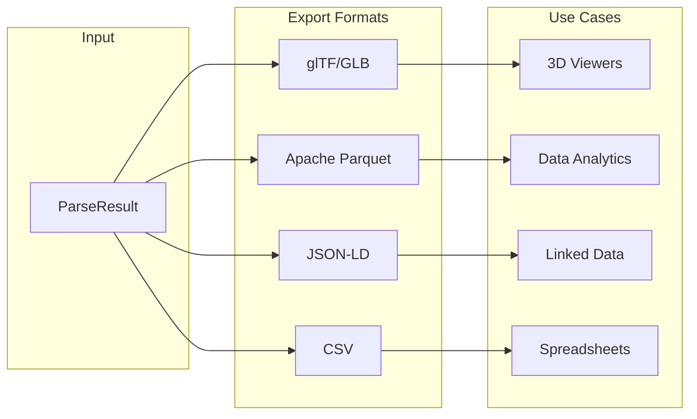
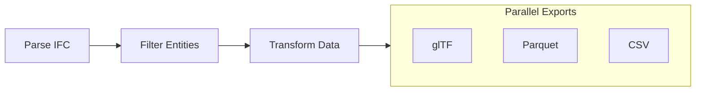

# Exporting Data

Guide to exporting IFC data in various formats.

## Overview

IFC-Lite supports multiple export formats:



## glTF Export

Export geometry for use in standard 3D viewers:

```typescript
import { GltfExporter } from '@ifc-lite/export';

const exporter = new GltfExporter();

// Export to glTF (JSON + binary)
const gltf = await exporter.export(parseResult, {
  format: 'gltf',
  embedImages: true,
  includeProperties: true
});

// Save files
await saveFile('model.gltf', gltf.json);
await saveFile('model.bin', gltf.binary);

// Export to GLB (single binary file)
const glb = await exporter.export(parseResult, {
  format: 'glb'
});
await saveFile('model.glb', glb);
```

### glTF Options

```typescript
interface GltfExportOptions {
  // Output format
  format: 'gltf' | 'glb';

  // Include IFC properties as extras
  includeProperties?: boolean;

  // Embed textures/images
  embedImages?: boolean;

  // Draco compression
  useDraco?: boolean;
  dracoOptions?: {
    quantization?: number;
    compressionLevel?: number;
  };

  // Filter entities
  entityFilter?: (entity: Entity) => boolean;

  // Coordinate system
  yUp?: boolean; // Convert from Z-up to Y-up
}
```

### glTF with Properties

```typescript
const gltf = await exporter.export(parseResult, {
  format: 'glb',
  includeProperties: true
});

// Properties are stored in node extras:
// {
//   "nodes": [{
//     "name": "Wall-001",
//     "extras": {
//       "expressId": 123,
//       "globalId": "2O2Fr$...",
//       "type": "IFCWALL",
//       "properties": {
//         "Pset_WallCommon": {
//           "IsExternal": true,
//           "FireRating": 60
//         }
//       }
//     }
//   }]
// }
```

## Parquet Export

Export to Apache Parquet for analytics with tools like DuckDB, Pandas, or Polars:

```typescript
import { ParquetExporter } from '@ifc-lite/export';

const exporter = new ParquetExporter();

// Export entities
const entitiesParquet = await exporter.exportEntities(parseResult);
await saveFile('entities.parquet', entitiesParquet);

// Export properties
const propsParquet = await exporter.exportProperties(parseResult);
await saveFile('properties.parquet', propsParquet);

// Export quantities
const quantsParquet = await exporter.exportQuantities(parseResult);
await saveFile('quantities.parquet', quantsParquet);

// Export all tables
const bundle = await exporter.exportAll(parseResult);
await saveFile('entities.parquet', bundle.entities);
await saveFile('properties.parquet', bundle.properties);
await saveFile('quantities.parquet', bundle.quantities);
await saveFile('relationships.parquet', bundle.relationships);
```

### Parquet Schema

```mermaid
erDiagram
    ENTITIES {
        int64 express_id PK
        string type
        string global_id
        string name
        string description
        boolean has_geometry
    }

    PROPERTIES {
        int64 entity_id FK
        string pset_name
        string prop_name
        string value
        string value_type
    }

    QUANTITIES {
        int64 entity_id FK
        string name
        float64 value
        string unit
    }

    RELATIONSHIPS {
        int64 from_id FK
        int64 to_id FK
        string rel_type
    }

    ENTITIES ||--o{ PROPERTIES : has
    ENTITIES ||--o{ QUANTITIES : has
    ENTITIES ||--o{ RELATIONSHIPS : from
    ENTITIES ||--o{ RELATIONSHIPS : to
```

### Using Parquet with Python

```python
import polars as pl

# Load exported data
entities = pl.read_parquet('entities.parquet')
properties = pl.read_parquet('properties.parquet')
quantities = pl.read_parquet('quantities.parquet')

# Analyze wall areas
wall_areas = (
    entities
    .filter(pl.col('type').str.contains('IFCWALL'))
    .join(quantities, left_on='express_id', right_on='entity_id')
    .filter(pl.col('name') == 'NetArea')
    .group_by('type')
    .agg([
        pl.count('express_id').alias('count'),
        pl.sum('value').alias('total_area'),
        pl.mean('value').alias('avg_area')
    ])
)
print(wall_areas)
```

## JSON-LD Export

Export as linked data for semantic web applications:

```typescript
import { JsonLdExporter } from '@ifc-lite/export';

const exporter = new JsonLdExporter();

const jsonld = await exporter.export(parseResult, {
  // Base URI for identifiers
  baseUri: 'https://example.com/project/',

  // Include geometry as GeoJSON
  includeGeometry: false,

  // IFC ontology namespace
  ontology: 'https://standards.buildingsmart.org/IFC/DEV/IFC4/ADD2/OWL'
});

await saveFile('model.jsonld', JSON.stringify(jsonld, null, 2));
```

### JSON-LD Structure

```json
{
  "@context": {
    "ifc": "https://standards.buildingsmart.org/IFC/DEV/IFC4/ADD2/OWL#",
    "schema": "https://schema.org/",
    "geo": "http://www.opengis.net/ont/geosparql#"
  },
  "@graph": [
    {
      "@id": "https://example.com/project/wall-123",
      "@type": "ifc:IfcWall",
      "ifc:globalId": "2O2Fr$t4X7Zf8NOew3FL9r",
      "ifc:name": "Wall-001",
      "ifc:hasPropertySet": [
        {
          "@type": "ifc:IfcPropertySet",
          "ifc:name": "Pset_WallCommon",
          "ifc:hasProperty": [
            {
              "@type": "ifc:IfcPropertySingleValue",
              "ifc:name": "IsExternal",
              "ifc:value": true
            }
          ]
        }
      ]
    }
  ]
}
```

## CSV Export

Export tabular data for spreadsheet applications:

```typescript
import { CsvExporter } from '@ifc-lite/export';

const exporter = new CsvExporter();

// Export entity list
const entitiesCsv = await exporter.exportEntities(parseResult, {
  columns: ['expressId', 'type', 'globalId', 'name']
});
await saveFile('entities.csv', entitiesCsv);

// Export properties (pivoted)
const propsCsv = await exporter.exportPropertiesPivot(parseResult, {
  psetName: 'Pset_WallCommon',
  entityTypes: ['IFCWALL', 'IFCWALLSTANDARDCASE']
});
await saveFile('wall_properties.csv', propsCsv);

// Export quantities
const quantsCsv = await exporter.exportQuantities(parseResult);
await saveFile('quantities.csv', quantsCsv);
```

### CSV Output Example

```csv
expressId,type,globalId,name,IsExternal,FireRating,LoadBearing
123,IFCWALL,2O2Fr$t4X7Zf8NOew3FL9r,Wall-001,true,60,true
456,IFCWALLSTANDARDCASE,3P3Gs$u5Y8Ag9PQfx4GM0s,Wall-002,false,30,false
```

## Custom Export

Create custom export formats:

```typescript
import { ExportPipeline } from '@ifc-lite/export';

// Define custom exporter
class CustomExporter {
  export(parseResult: ParseResult): CustomFormat {
    const output: CustomFormat = {
      metadata: {
        schema: parseResult.schema,
        timestamp: new Date().toISOString()
      },
      elements: []
    };

    for (const entity of parseResult.entities) {
      if (entity.type.startsWith('IFCWALL')) {
        output.elements.push({
          id: entity.expressId,
          name: entity.name,
          properties: parseResult.getProperties(entity.expressId),
          quantities: parseResult.getQuantities(entity.expressId)
        });
      }
    }

    return output;
  }
}

// Use custom exporter
const exporter = new CustomExporter();
const custom = exporter.export(parseResult);
```

## Filtered Export

Export only specific entities:

```typescript
import { GltfExporter } from '@ifc-lite/export';
import { IfcQuery } from '@ifc-lite/query';

// Filter entities with query
const query = new IfcQuery(parseResult);
const externalWalls = query
  .walls()
  .whereProperty('Pset_WallCommon', 'IsExternal', '=', true)
  .toArray();

// Export filtered set
const exporter = new GltfExporter();
const glb = await exporter.export(parseResult, {
  format: 'glb',
  entityFilter: (entity) =>
    externalWalls.some(w => w.expressId === entity.expressId)
});
```

## Export Pipeline

Chain multiple exports:



```typescript
import { ExportPipeline } from '@ifc-lite/export';

const pipeline = new ExportPipeline(parseResult);

// Run multiple exports in parallel
const results = await pipeline.export([
  { format: 'glb', options: { useDraco: true } },
  { format: 'parquet', tables: ['entities', 'properties'] },
  { format: 'csv', columns: ['expressId', 'type', 'name'] }
]);

// Save all results
await saveFile('model.glb', results.glb);
await saveFile('entities.parquet', results.parquet.entities);
await saveFile('entities.csv', results.csv);
```

## Next Steps

- [Query Guide](querying.md) - Filter data before export
- [API Reference](../api/typescript.md) - Complete API docs
