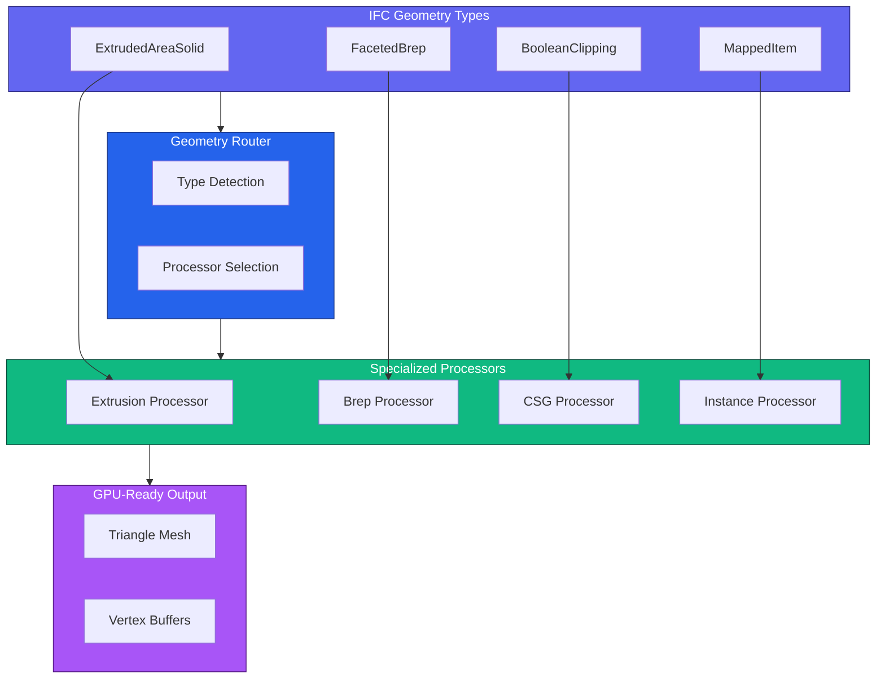
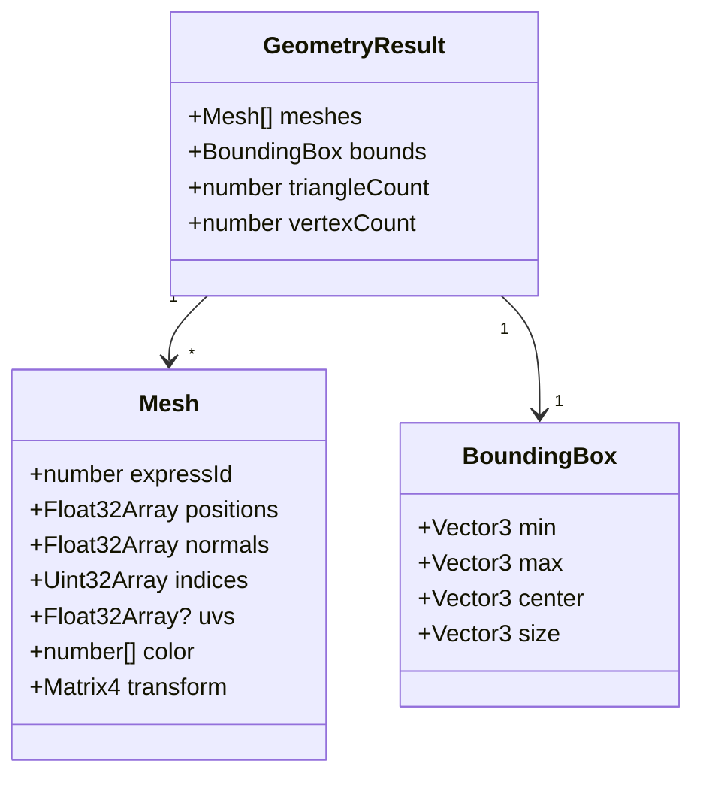
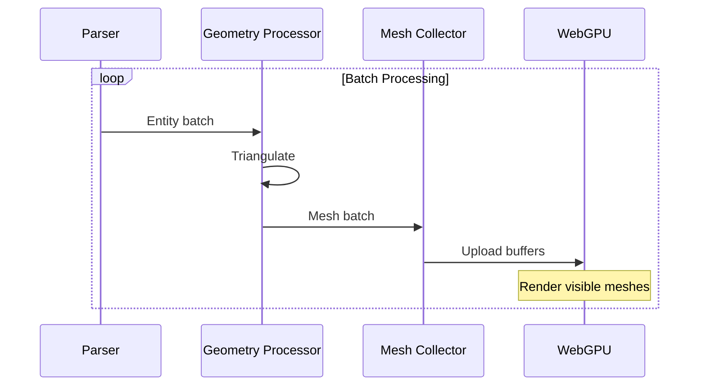
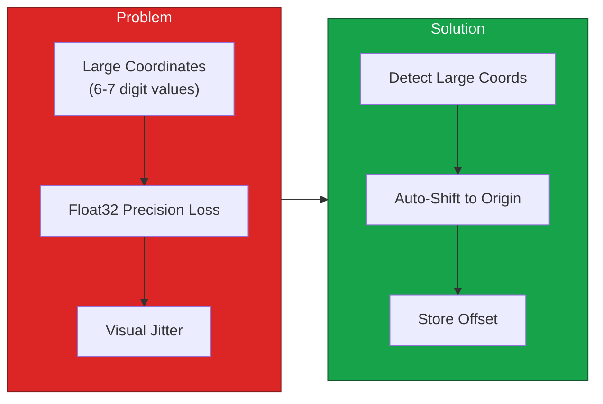
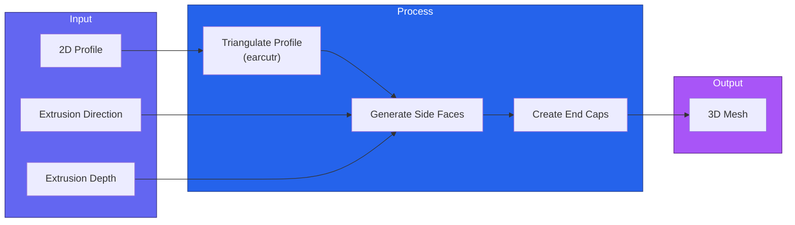
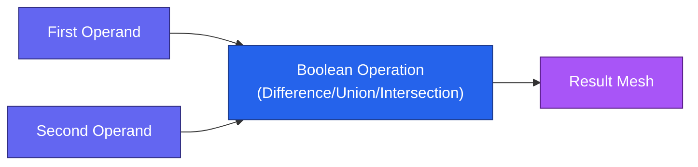

# Geometry Processing

Guide to geometry extraction and processing in IFC-Lite.

## Overview

IFC-Lite processes IFC geometry through a streaming pipeline:



## Geometry Quality Modes

| Mode | Curve Segments | Use Case |
|------|---------------|----------|
| `FAST` | 8 | Quick preview, mobile devices |
| `BALANCED` | 16 | Default, good quality/performance |
| `HIGH` | 32 | Maximum quality, detailed models |

```typescript
import { IfcParser, GeometryQuality } from '@ifc-lite/parser';

const parser = new IfcParser();

// Fast mode for quick loading
const fastResult = await parser.parse(buffer, {
  geometryQuality: GeometryQuality.FAST
});

// High quality for detailed viewing
const highResult = await parser.parse(buffer, {
  geometryQuality: GeometryQuality.HIGH
});
```

## Mesh Data Structure



### Accessing Mesh Data

```typescript
const result = await parser.parse(buffer);

// Get all meshes
for (const mesh of result.geometry.meshes) {
  console.log(`Entity #${mesh.expressId}:`);
  console.log(`  Vertices: ${mesh.positions.length / 3}`);
  console.log(`  Triangles: ${mesh.indices.length / 3}`);
  console.log(`  Color: rgba(${mesh.color.join(', ')})`);
}

// Get mesh by entity ID
const wallMesh = result.geometry.getMesh(wallEntity.expressId);

// Access bounds
console.log(`Model bounds:`, result.geometry.bounds);
console.log(`Center:`, result.geometry.bounds.center);
```

## Streaming Geometry

Process geometry incrementally for large files:



### Streaming Example

```typescript
import { IfcParser, GeometryBatch } from '@ifc-lite/parser';

const parser = new IfcParser();
const renderer = new Renderer(canvas);

await parser.parseStreaming(buffer, {
  batchSize: 100,

  onBatch: async (batch: GeometryBatch) => {
    // Upload meshes to GPU
    for (const mesh of batch.meshes) {
      await renderer.addMesh(mesh);
    }

    // Update bounds
    if (batch.bounds) {
      renderer.updateBounds(batch.bounds);
    }

    // Render current state
    renderer.render();
  },

  onComplete: () => {
    renderer.fitToView();
  }
});
```

## Coordinate Handling

IFC files often use large georeferenced coordinates that cause precision issues:



### Auto Origin Shift

```typescript
const result = await parser.parse(buffer, {
  autoOriginShift: true
});

// Access the computed shift
if (result.coordinateShift) {
  console.log(`Origin shifted by:`, result.coordinateShift);
  // { x: 487234.5, y: 5234891.2, z: 0 }
}

// Convert local coordinates back to world
function toWorldCoords(localPos: Vector3): Vector3 {
  return {
    x: localPos.x + result.coordinateShift.x,
    y: localPos.y + result.coordinateShift.y,
    z: localPos.z + result.coordinateShift.z
  };
}
```

## Geometry Processors

### Extrusion Processor

Handles `IfcExtrudedAreaSolid` entities:



### Brep Processor

Handles `IfcFacetedBrep` entities:

```typescript
// Brep processing is straightforward - faces are already triangulated
// in most cases, or need simple fan triangulation

const brepMesh = processBrep({
  faces: brepEntity.faces,
  vertices: brepEntity.vertices
});
```

### Boolean Operations

Handles `IfcBooleanClippingResult`:



## Custom Geometry Processing

Extend geometry processing for custom needs:

```typescript
import { GeometryProcessor, ProcessorRegistry } from '@ifc-lite/geometry';

// Create custom processor
class CustomProfileProcessor extends GeometryProcessor {
  canProcess(entity: Entity): boolean {
    return entity.type === 'IFCARBITRARYCLOSEDPROFILEDEF';
  }

  process(entity: Entity): Mesh {
    // Custom triangulation logic
    const points = this.extractPoints(entity);
    const triangles = this.triangulate(points);
    return this.buildMesh(triangles);
  }
}

// Register processor
ProcessorRegistry.register(new CustomProfileProcessor());
```

## Instancing

IFC often uses mapped representations for repeated elements:

```typescript
// Detect instanced geometry
const instances = result.geometry.getInstances(mesh.expressId);

if (instances.length > 1) {
  console.log(`Mesh is instanced ${instances.length} times`);

  // Get transformation matrices for each instance
  const transforms = instances.map(i => i.transform);

  // Use GPU instancing for efficient rendering
  renderer.addInstancedMesh(mesh, transforms);
}
```

## Performance Optimization

### Memory-Efficient Processing

```typescript
// Process in chunks to limit memory
await parser.parseStreaming(buffer, {
  batchSize: 50,
  memoryLimit: 512, // MB

  onBatch: async (batch) => {
    // Process and upload
    await renderer.addMeshes(batch.meshes);

    // Clear batch from memory
    batch.dispose();
  }
});
```

### Skip Unnecessary Geometry

```typescript
// Skip spaces and openings for faster loading
const result = await parser.parse(buffer, {
  excludeTypes: [
    'IFCSPACE',
    'IFCOPENINGELEMENT',
    'IFCFLOWSEGMENT' // Skip MEP if not needed
  ]
});
```

## Geometry Statistics

```typescript
const result = await parser.parse(buffer);
const stats = result.geometry.getStatistics();

console.log('Geometry Statistics:');
console.log(`  Total meshes: ${stats.meshCount}`);
console.log(`  Total triangles: ${stats.triangleCount}`);
console.log(`  Total vertices: ${stats.vertexCount}`);
console.log(`  Instanced meshes: ${stats.instancedCount}`);
console.log(`  Memory usage: ${stats.memoryMB.toFixed(1)} MB`);

// Breakdown by entity type
for (const [type, count] of Object.entries(stats.byType)) {
  console.log(`  ${type}: ${count} meshes`);
}
```

## Next Steps

- [Rendering Guide](rendering.md) - Display geometry with WebGPU
- [Parsing Guide](parsing.md) - Parse options and streaming
- [API Reference](../api/typescript.md) - Complete API docs
