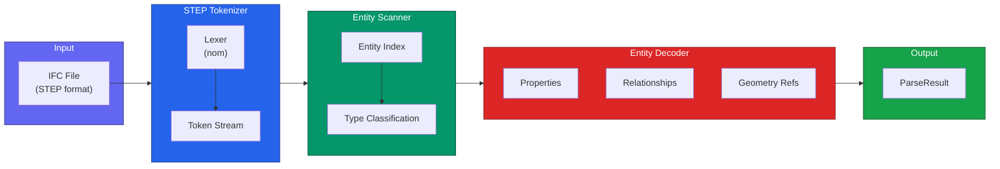
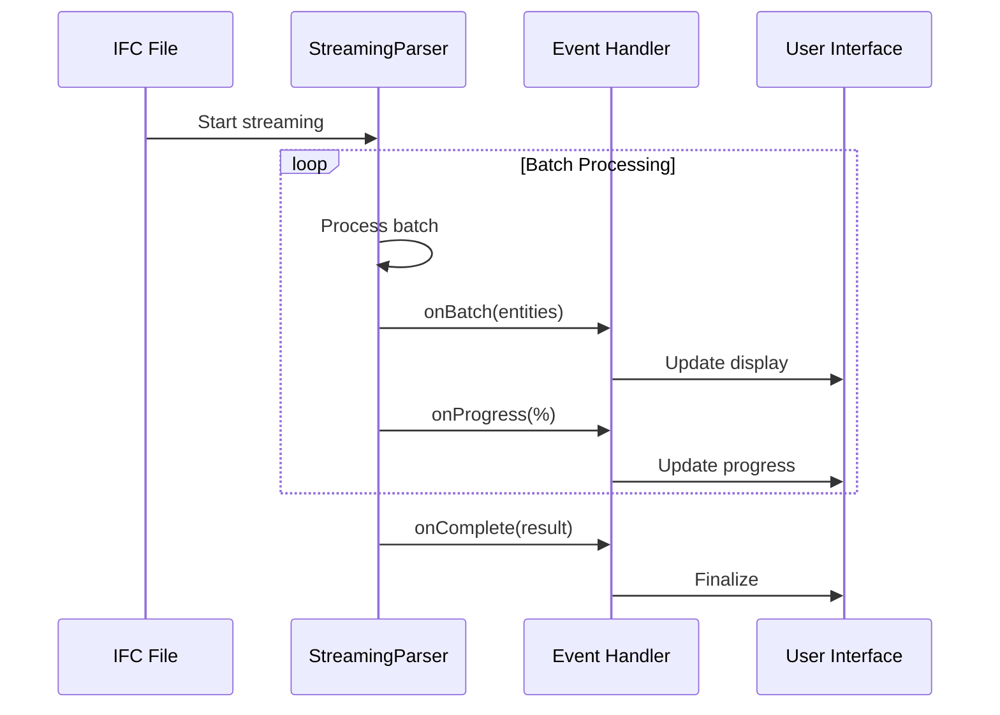
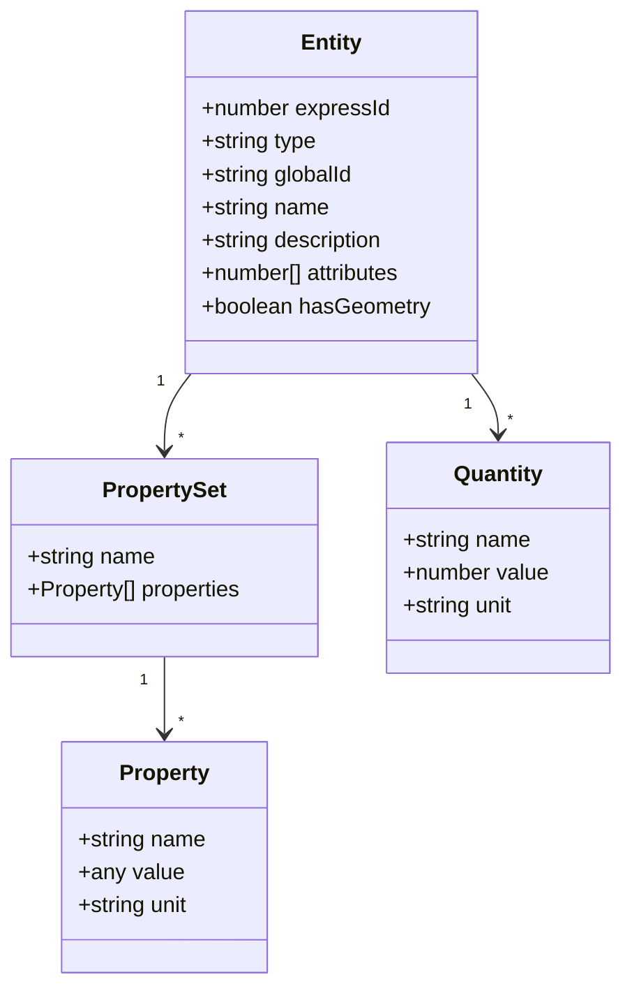
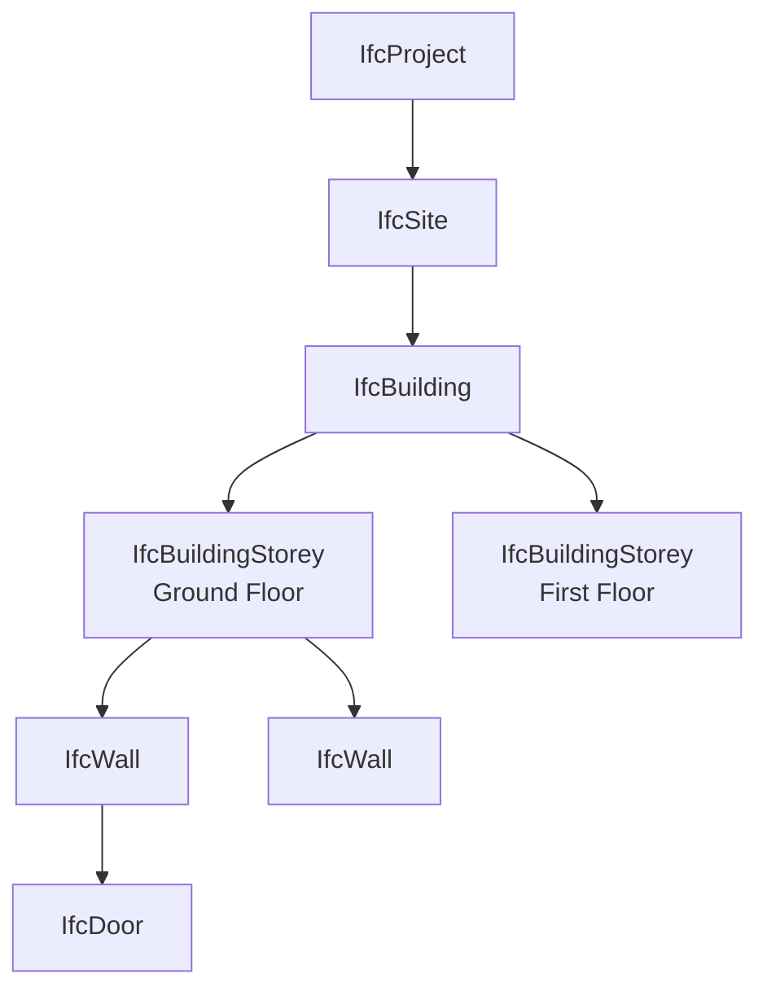

# Parsing IFC Files

Complete guide to parsing IFC files with IFC-Lite.

## Overview

The parsing pipeline transforms IFC/STEP files into structured data:



## Basic Parsing

```typescript
import { IfcParser } from '@ifc-lite/parser';

const parser = new IfcParser();

// Parse from ArrayBuffer
const result = await parser.parse(arrayBuffer);

// Parse from File
const file = document.getElementById('input').files[0];
const fileBuffer = await file.arrayBuffer();
const result = await parser.parse(fileBuffer);

// Parse from URL
const response = await fetch('model.ifc');
const urlBuffer = await response.arrayBuffer();
const result = await parser.parse(urlBuffer);
```

## Parse Options

```typescript
interface ParseOptions {
  // Progress callback
  onProgress?: (progress: Progress) => void;

  // Geometry quality: 'FAST' | 'BALANCED' | 'HIGH'
  geometryQuality?: GeometryQuality;

  // Skip geometry processing (parsing only)
  skipGeometry?: boolean;

  // Auto-shift large coordinates to origin
  autoOriginShift?: boolean;

  // Custom coordinate origin
  customOrigin?: { x: number; y: number; z: number };

  // Memory limit in MB
  memoryLimit?: number;

  // Entity type filter
  includeTypes?: string[];
  excludeTypes?: string[];
}

// Example usage
const result = await parser.parse(buffer, {
  geometryQuality: 'BALANCED',
  autoOriginShift: true,
  onProgress: (p) => updateProgressBar(p.percent),
  excludeTypes: ['IFCSPACE', 'IFCOPENINGELEMENT']
});
```

## Streaming Parser

For large files, streaming parsing provides better memory efficiency and earlier visual feedback:



### Streaming Example

```typescript
import { IfcParser, StreamingOptions } from '@ifc-lite/parser';

const parser = new IfcParser();

const streamOptions: StreamingOptions = {
  // Process entities in batches of 100
  batchSize: 100,

  // Handle each batch
  onBatch: async (batch) => {
    console.log(`Batch ${batch.index}: ${batch.entities.length} entities`);

    // Add meshes to renderer incrementally
    if (batch.meshes.length > 0) {
      await renderer.addMeshes(batch.meshes);
    }
  },

  // Progress updates
  onProgress: (progress) => {
    progressBar.value = progress.percent;
    statusText.textContent = `${progress.entitiesProcessed} / ${progress.totalEntities}`;
  },

  // Handle errors without stopping
  onError: (error) => {
    console.warn('Non-fatal error:', error.message);
  }
};

const result = await parser.parseStreaming(buffer, streamOptions);
```

## Parse Result Structure

```typescript
interface ParseResult {
  // File metadata
  header: IfcHeader;
  schema: 'IFC2X3' | 'IFC4' | 'IFC4X3';

  // Entity data
  entities: Entity[];
  entityCount: number;

  // Geometry data
  geometry: GeometryResult;

  // Relationships
  relationships: RelationshipGraph;

  // Coordinate info
  coordinateShift?: Vector3;

  // Helper methods
  getEntity(expressId: number): Entity | undefined;
  getProperties(expressId: number): PropertyMap;
  getPropertySets(expressId: number): PropertySetMap;
  getQuantities(expressId: number): QuantityMap;
  getRelated(expressId: number, relType: string): Entity[];
}
```

## Entity Structure



### Accessing Entities

```typescript
// Get entity by express ID
const entity = result.getEntity(123);

// Access basic properties
console.log(`Name: ${entity.name}`);
console.log(`Type: ${entity.type}`);
console.log(`GlobalId: ${entity.globalId}`);

// Filter by type
const walls = result.entities.filter(e => e.type === 'IFCWALL');
const doors = result.entities.filter(e => e.type === 'IFCDOOR');

// Check for geometry
const geoEntities = result.entities.filter(e => e.hasGeometry);
```

## Property Extraction

```typescript
// Get all properties for an entity
const props = result.getProperties(entity.expressId);
// { Name: 'Wall-001', ObjectType: 'Basic Wall', ... }

// Get property sets
const psets = result.getPropertySets(entity.expressId);
// {
//   'Pset_WallCommon': {
//     IsExternal: true,
//     FireRating: 60,
//     ...
//   },
//   'Custom_Properties': { ... }
// }

// Get quantities
const quantities = result.getQuantities(entity.expressId);
// {
//   NetArea: { value: 25.5, unit: 'm2' },
//   NetVolume: { value: 5.1, unit: 'm3' },
//   Length: { value: 10.0, unit: 'm' }
// }
```

## Relationship Graph



### Traversing Relationships

```typescript
// Get containing structure
const storey = result.relationships.getContainer(wall.expressId);
const building = result.relationships.getContainer(storey.expressId);

// Get contained elements
const elements = result.relationships.getContained(storey.expressId);

// Get related elements
const openings = result.relationships.getRelated(wall.expressId, 'IfcRelVoidsElement');
const materials = result.relationships.getRelated(wall.expressId, 'IfcRelAssociatesMaterial');

// Navigate the spatial hierarchy
const hierarchy = result.relationships.getSpatialHierarchy();
```

## Schema Support

IFC-Lite supports multiple IFC schemas:

| Schema | Entities | Status |
|--------|----------|--------|
| IFC2X3 | 653 | :material-check: Supported |
| IFC4 | 776 | :material-check: Full Support |
| IFC4X3 | 876 | :material-check: Supported |

### Schema Detection

```typescript
const result = await parser.parse(buffer);

console.log(`Schema: ${result.schema}`);
// Output: Schema: IFC4

// Check for specific entity support
if (result.schema === 'IFC4X3') {
  // Access IFC4X3-specific entities
  const alignments = result.entities.filter(e => e.type === 'IFCALIGNMENT');
}
```

## Error Handling

```typescript
import { IfcParser, ParseError, TokenError, SchemaError } from '@ifc-lite/parser';

try {
  const result = await parser.parse(buffer);
} catch (error) {
  if (error instanceof TokenError) {
    // Malformed STEP syntax
    console.error(`Token error at line ${error.line}: ${error.message}`);
  } else if (error instanceof SchemaError) {
    // Unknown or unsupported schema
    console.error(`Schema error: ${error.message}`);
  } else if (error instanceof ParseError) {
    // General parse error
    console.error(`Parse error: ${error.message}`);
  } else {
    throw error;
  }
}
```

## Performance Tips

1. **Use streaming for large files** (>50 MB)
2. **Skip geometry** if you only need metadata
3. **Filter entity types** to reduce memory usage
4. **Enable auto-origin shift** for georeferenced models

```typescript
// Optimized for large files
const result = await parser.parseStreaming(largeBuffer, {
  batchSize: 200,
  geometryQuality: 'FAST',
  autoOriginShift: true,
  excludeTypes: ['IFCSPACE', 'IFCOPENINGELEMENT'],
  onProgress: updateUI
});
```

## Next Steps

- [Geometry Guide](geometry.md) - Process geometry
- [Query Guide](querying.md) - Query parsed data
- [API Reference](../api/typescript.md) - Complete API docs
