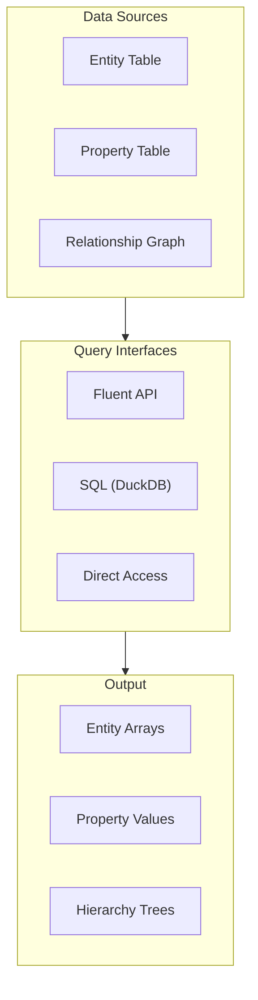
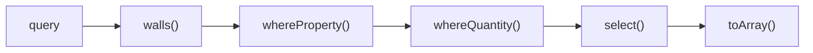
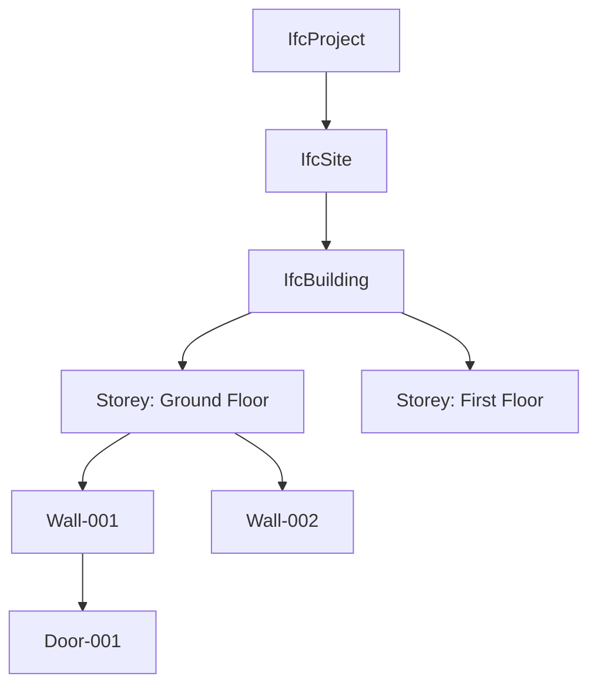
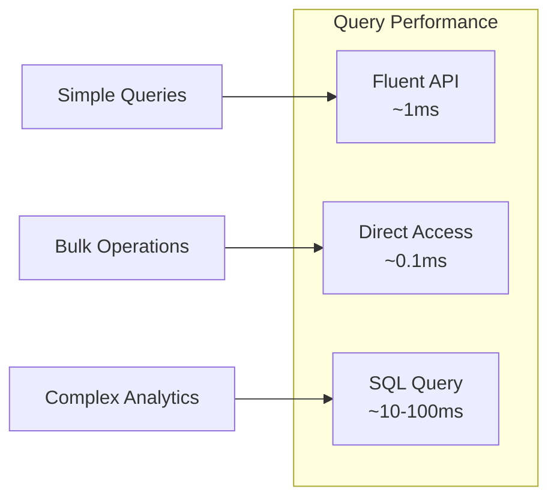

# Querying Data

Guide to querying IFC data with IFC-Lite.

## Overview

IFC-Lite provides multiple query interfaces:



## Fluent Query API

### Basic Queries

```typescript
import { IfcQuery } from '@ifc-lite/query';

const query = new IfcQuery(parseResult);

// Get all walls
const walls = query.walls().toArray();

// Get all doors
const doors = query.doors().toArray();

// Get all windows
const windows = query.windows().toArray();

// Get specific entity types
const beams = query.ofType('IFCBEAM').toArray();
const columns = query.ofType('IFCCOLUMN').toArray();
```

### Type Shortcuts

| Method | Entity Type |
|--------|-------------|
| `.walls()` | IFCWALL, IFCWALLSTANDARDCASE |
| `.doors()` | IFCDOOR |
| `.windows()` | IFCWINDOW |
| `.slabs()` | IFCSLAB |
| `.roofs()` | IFCROOF |
| `.stairs()` | IFCSTAIR, IFCSTAIRFLIGHT |
| `.columns()` | IFCCOLUMN |
| `.beams()` | IFCBEAM |
| `.spaces()` | IFCSPACE |
| `.furniture()` | IFCFURNISHINGELEMENT |

### Property Filters

```typescript
// Filter by property value
const externalWalls = query
  .walls()
  .whereProperty('Pset_WallCommon', 'IsExternal', '=', true)
  .toArray();

// Filter by numeric comparison
const fireRatedWalls = query
  .walls()
  .whereProperty('Pset_WallCommon', 'FireRating', '>=', 60)
  .toArray();

// Filter by string pattern
const loadBearing = query
  .walls()
  .whereProperty('Pset_WallCommon', 'LoadBearing', '=', true)
  .toArray();
```

### Chained Queries



```typescript
// Complex query chain
const results = query
  .walls()
  .whereProperty('Pset_WallCommon', 'IsExternal', '=', true)
  .whereProperty('Pset_WallCommon', 'FireRating', '>=', 60)
  .whereQuantity('NetArea', '>', 10)
  .select(['expressId', 'name', 'type'])
  .toArray();

console.log(results);
// [
//   { expressId: 123, name: 'Wall-001', type: 'IFCWALL' },
//   { expressId: 456, name: 'Wall-002', type: 'IFCWALLSTANDARDCASE' },
//   ...
// ]
```

## Spatial Queries

### Hierarchy Navigation



```typescript
// Get all storeys
const storeys = query.storeys().toArray();

// Get elements on a specific storey
const groundFloor = query
  .storey('Ground Floor')
  .contains()
  .toArray();

// Get all elements in a building
const buildingElements = query
  .building('Main Building')
  .allContained()  // Recursive
  .toArray();

// Navigate up the hierarchy
const wall = query.entity(123);
const storey = wall.containedIn().first();
const building = storey.containedIn().first();
```

### Spatial Relationships

```typescript
// Get entities related by spatial structure
const contained = query
  .entity(storeyId)
  .contains()
  .toArray();

// Get container
const container = query
  .entity(wallId)
  .containedIn()
  .first();

// Get adjacent spaces
const adjacentSpaces = query
  .entity(spaceId)
  .adjacent()
  .toArray();
```

## Relationship Queries

### Finding Related Entities

```typescript
// Get materials for an entity
const materials = query
  .entity(wallId)
  .materials()
  .toArray();

// Get property sets
const psets = query
  .entity(wallId)
  .propertySets()
  .toArray();

// Get openings in a wall
const openings = query
  .entity(wallId)
  .related('IfcRelVoidsElement')
  .toArray();

// Get filling elements (doors/windows in openings)
const fillings = query
  .entity(openingId)
  .related('IfcRelFillsElement')
  .toArray();
```

### Relationship Types

| Relationship | Description |
|--------------|-------------|
| `IfcRelContainedInSpatialStructure` | Element → Spatial container |
| `IfcRelAggregates` | Parent → Children (decomposition) |
| `IfcRelVoidsElement` | Element → Opening |
| `IfcRelFillsElement` | Opening → Filling (door/window) |
| `IfcRelAssociatesMaterial` | Element → Material |
| `IfcRelDefinesByProperties` | Element → Property sets |
| `IfcRelDefinesByType` | Element → Type definition |

## SQL Queries

For complex analytics, use SQL via DuckDB:

```typescript
import { IfcQuery } from '@ifc-lite/query';

const query = new IfcQuery(parseResult);

// Enable SQL mode (loads DuckDB-WASM)
await query.enableSQL();

// Run SQL queries
const result = await query.sql(`
  SELECT
    type,
    COUNT(*) as count,
    AVG(CAST(props->>'Pset_WallCommon.FireRating' AS INTEGER)) as avg_fire_rating
  FROM entities
  WHERE type LIKE 'IFCWALL%'
  GROUP BY type
  ORDER BY count DESC
`);

console.table(result);
// ┌──────────────────────┬───────┬─────────────────┐
// │ type                 │ count │ avg_fire_rating │
// ├──────────────────────┼───────┼─────────────────┤
// │ IFCWALLSTANDARDCASE  │ 42    │ 45              │
// │ IFCWALL              │ 18    │ 30              │
// └──────────────────────┴───────┴─────────────────┘
```

### SQL Table Schema

```typescript
// Entities table
interface EntitiesTable {
  express_id: number;
  type: string;
  global_id: string;
  name: string | null;
  description: string | null;
  has_geometry: boolean;
  props: JSON;  // All properties as JSON
}

// Properties table
interface PropertiesTable {
  entity_id: number;
  pset_name: string;
  prop_name: string;
  value: string;
  value_type: string;
}

// Quantities table
interface QuantitiesTable {
  entity_id: number;
  name: string;
  value: number;
  unit: string;
}

// Relationships table
interface RelationshipsTable {
  from_id: number;
  to_id: number;
  rel_type: string;
}
```

### Complex SQL Examples

```sql
-- Find walls with their storey names
SELECT
  e.express_id,
  e.name as wall_name,
  s.name as storey_name
FROM entities e
JOIN relationships r ON e.express_id = r.from_id
JOIN entities s ON r.to_id = s.express_id
WHERE e.type LIKE 'IFCWALL%'
  AND r.rel_type = 'IfcRelContainedInSpatialStructure'
  AND s.type = 'IFCBUILDINGSTOREY';

-- Calculate total area by entity type
SELECT
  e.type,
  SUM(q.value) as total_area
FROM entities e
JOIN quantities q ON e.express_id = q.entity_id
WHERE q.name = 'NetArea'
GROUP BY e.type
ORDER BY total_area DESC;

-- Find entities with missing fire ratings
SELECT express_id, name, type
FROM entities
WHERE type LIKE 'IFCWALL%'
  AND props->>'Pset_WallCommon.FireRating' IS NULL;
```

## Direct Data Access

For performance-critical operations, access columnar data directly:

```typescript
const data = parseResult.data;

// Access entity table
const entityTable = data.entities;
console.log(`Total entities: ${entityTable.count}`);

// Iterate efficiently
for (let i = 0; i < entityTable.count; i++) {
  const expressId = entityTable.expressIds[i];
  const typeEnum = entityTable.typeEnums[i];
  const nameIdx = entityTable.nameIndices[i];
  const name = data.strings.get(nameIdx);
}

// Access property table
const propTable = data.properties;
for (let i = 0; i < propTable.count; i++) {
  const entityId = propTable.entityIds[i];
  const value = propTable.values[i];
}
```

## Query Performance



### Performance Tips

1. **Use type shortcuts** for common entity types
2. **Filter early** to reduce result set size
3. **Use direct access** for performance-critical loops
4. **Use SQL** for complex aggregations
5. **Cache query results** when reusing

```typescript
// Efficient: filter by type first
const result = query
  .walls()
  .whereProperty('Pset_WallCommon', 'IsExternal', '=', true)
  .toArray();

// Inefficient: filter all entities
const result = query
  .all()
  .whereProperty('Pset_WallCommon', 'IsExternal', '=', true)
  .ofType('IFCWALL')
  .toArray();
```

## Next Steps

- [Export Guide](exporting.md) - Export query results
- [API Reference](../api/typescript.md) - Complete API docs
