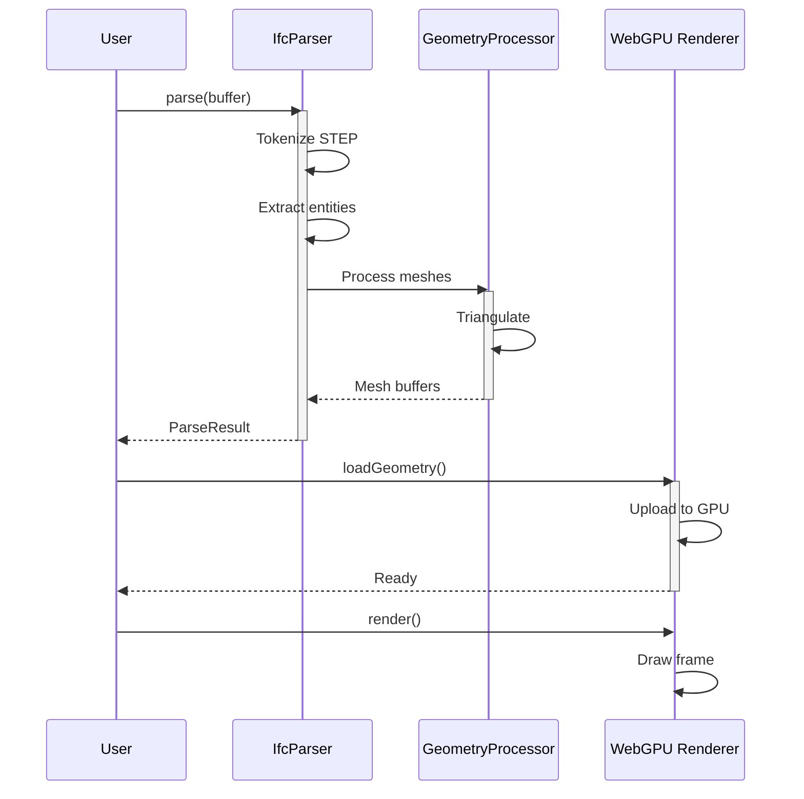

# Quick Start

Get up and running with IFC-Lite in under 5 minutes.

## Basic Setup

### 1. Install the Packages

```bash
pnpm add @ifc-lite/parser @ifc-lite/renderer
```

### 2. Create an HTML File

```html
<!DOCTYPE html>
<html>
<head>
  <title>IFC-Lite Viewer</title>
  <style>
    #viewer {
      width: 100%;
      height: 100vh;
    }
  </style>
</head>
<body>
  <canvas id="viewer"></canvas>
  <script type="module" src="main.js"></script>
</body>
</html>
```

### 3. Write Your Code

```typescript
// main.ts
import { IfcParser } from '@ifc-lite/parser';
import { Renderer } from '@ifc-lite/renderer';

async function main() {
  // Get the canvas element
  const canvas = document.getElementById('viewer') as HTMLCanvasElement;

  // Initialize the renderer
  const renderer = new Renderer(canvas);
  await renderer.init();

  // Load an IFC file
  const response = await fetch('model.ifc');
  const buffer = await response.arrayBuffer();

  // Parse the IFC file
  const parser = new IfcParser();
  const result = await parser.parse(buffer, {
    onProgress: (progress) => {
      console.log(`Parsing: ${progress.percent}%`);
    }
  });

  // Load geometry into renderer
  await renderer.loadGeometry(result.geometry);

  // Start rendering
  renderer.render();

  // Log some info
  console.log(`Loaded ${result.entities.length} entities`);
}

main();
```

## Understanding the Data Flow



## Working with Entities

### Filtering Entities

```typescript
// Get all walls
const walls = result.entities.filter(e => e.type === 'IFCWALL');

// Get all spaces
const spaces = result.entities.filter(e => e.type === 'IFCSPACE');

// Get entities by GlobalId
const entity = result.entities.find(e => e.globalId === '2O2Fr$t4X7Zf8NOew3FL9r');
```

### Accessing Properties

```typescript
// Get properties for an entity
const wallProps = result.getProperties(wall.expressId);

// Get property sets
const psets = result.getPropertySets(wall.expressId);

// Access specific property
const fireRating = psets['Pset_WallCommon']?.FireRating;
```

### Querying with Fluent API

```typescript
import { IfcQuery } from '@ifc-lite/query';

const query = new IfcQuery(result);

// Find walls with fire rating > 60
const fireRatedWalls = query
  .walls()
  .whereProperty('Pset_WallCommon', 'FireRating', '>', 60)
  .toArray();

// Find all elements on a specific storey
const storeyElements = query
  .storey('First Floor')
  .contains()
  .toArray();
```

## Geometry Streaming

For large files, use streaming to start rendering before the full file is parsed:

```typescript
const parser = new IfcParser();
const renderer = new Renderer(canvas);

// Stream geometry as it's processed
await parser.parseStreaming(buffer, {
  batchSize: 100,
  onBatch: async (batch) => {
    await renderer.addMeshes(batch.meshes);
    console.log(`Added ${batch.meshes.length} meshes`);
  },
  onProgress: (progress) => {
    console.log(`${progress.percent}% complete`);
  }
});

// Fit camera to loaded geometry
renderer.fitToView();
```

## Handling Large Coordinates

IFC files often contain georeferenced coordinates that can cause precision issues:

```typescript
const result = await parser.parse(buffer, {
  // Automatically shift coordinates to origin
  autoOriginShift: true,

  // Or specify a custom origin
  customOrigin: { x: 0, y: 0, z: 0 }
});

// Access the computed origin shift
console.log('Origin shift:', result.coordinateShift);
```

## Error Handling

```typescript
import { IfcParser, ParseError } from '@ifc-lite/parser';

try {
  const result = await parser.parse(buffer);
} catch (error) {
  if (error instanceof ParseError) {
    console.error('Parse error:', error.message);
    console.error('At line:', error.line);
    console.error('At column:', error.column);
  } else {
    throw error;
  }
}
```

## Next Steps

- [Parsing Guide](parsing.md) - Deep dive into parsing options
- [Geometry Guide](geometry.md) - Understand geometry processing
- [Rendering Guide](rendering.md) - Configure the WebGPU renderer
- [Query Guide](querying.md) - Master the query system
