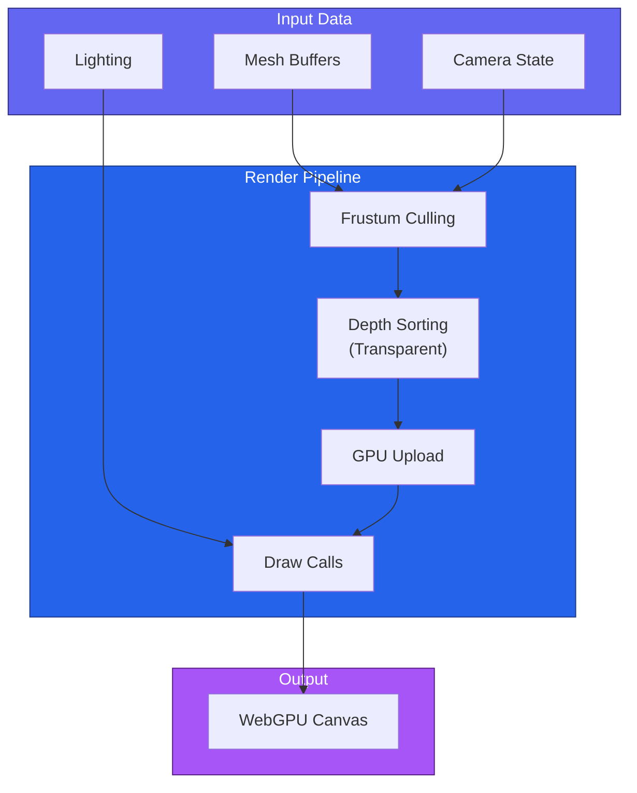
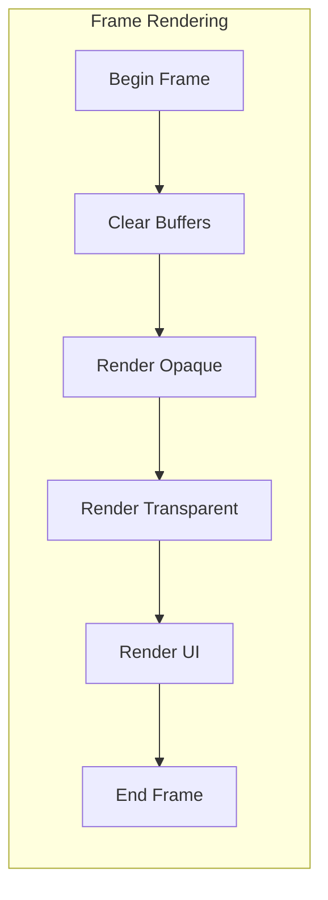
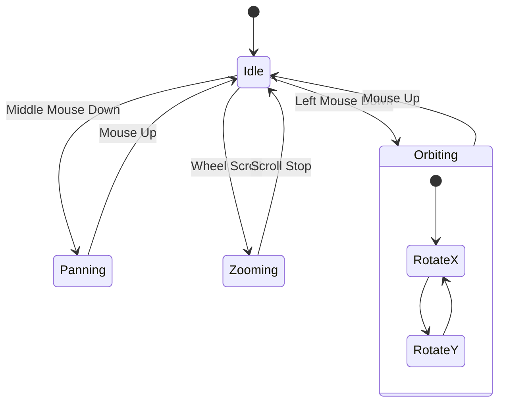
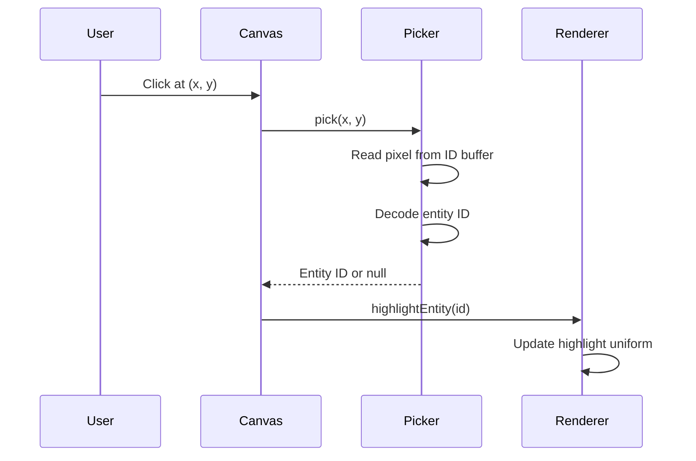
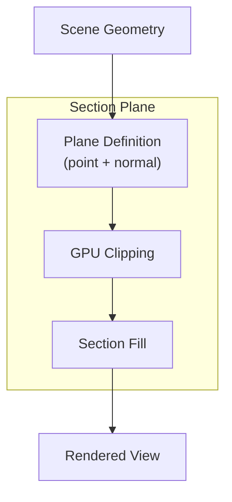
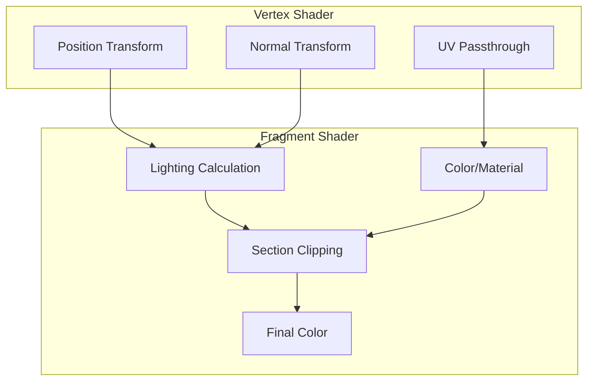

# Rendering

Guide to the WebGPU rendering pipeline in IFC-Lite.

## Overview

IFC-Lite uses WebGPU for modern, high-performance 3D rendering:



## Basic Setup

```typescript
import { Renderer } from '@ifc-lite/renderer';

// Initialize renderer
const canvas = document.getElementById('viewer') as HTMLCanvasElement;
const renderer = new Renderer(canvas);

// Initialize WebGPU
await renderer.init();

// Load geometry
const result = await parser.parse(buffer);
await renderer.loadGeometry(result.geometry);

// Start rendering
renderer.render();
```

## Renderer Configuration

```typescript
interface RendererOptions {
  // Anti-aliasing
  antialias?: boolean;
  sampleCount?: 1 | 4;

  // Background color
  backgroundColor?: [number, number, number, number];

  // Performance
  powerPreference?: 'low-power' | 'high-performance';

  // Features
  enablePicking?: boolean;
  enableShadows?: boolean;
  enableSectionPlanes?: boolean;
}

const renderer = new Renderer(canvas, {
  antialias: true,
  sampleCount: 4,
  backgroundColor: [0.95, 0.95, 0.95, 1.0],
  powerPreference: 'high-performance',
  enablePicking: true
});
```

## Render Pipeline



### Pipeline Stages

```typescript
class Renderer {
  render(): void {
    // Begin frame
    const commandEncoder = this.device.createCommandEncoder();
    const passEncoder = commandEncoder.beginRenderPass(this.renderPassDescriptor);

    // Set camera uniforms
    this.updateCameraUniforms();

    // Render opaque objects (front to back)
    this.renderOpaque(passEncoder);

    // Render transparent objects (back to front)
    this.renderTransparent(passEncoder);

    // Render UI elements
    this.renderUI(passEncoder);

    // End frame
    passEncoder.end();
    this.device.queue.submit([commandEncoder.finish()]);
  }
}
```

## Camera Controls



### Camera Configuration

```typescript
interface CameraOptions {
  // Initial position
  position?: [number, number, number];
  target?: [number, number, number];
  up?: [number, number, number];

  // Projection
  fov?: number;
  near?: number;
  far?: number;

  // Controls
  orbitSpeed?: number;
  panSpeed?: number;
  zoomSpeed?: number;

  // Constraints
  minDistance?: number;
  maxDistance?: number;
}

renderer.setCamera({
  position: [10, 10, 10],
  target: [0, 0, 0],
  fov: 45,
  orbitSpeed: 0.5,
  minDistance: 1,
  maxDistance: 1000
});
```

### Camera Operations

```typescript
// Fit camera to view all geometry
renderer.fitToView();

// Fit to specific entities
renderer.fitToEntities([wall.expressId, door.expressId]);

// Set view preset
renderer.setViewPreset('front');  // front, back, left, right, top, bottom, iso

// Animate camera
renderer.animateTo({
  position: [20, 15, 20],
  target: [0, 0, 5],
  duration: 500
});
```

## Selection and Picking



### Selection API

```typescript
// Enable picking
const renderer = new Renderer(canvas, { enablePicking: true });

// Handle click events
canvas.addEventListener('click', async (event) => {
  const rect = canvas.getBoundingClientRect();
  const x = event.clientX - rect.left;
  const y = event.clientY - rect.top;

  const result = await renderer.pick(x, y);

  if (result) {
    console.log(`Clicked entity #${result.expressId}`);
    renderer.select(result.expressId);
  } else {
    renderer.clearSelection();
  }
});

// Multi-selection
renderer.select([id1, id2, id3]);

// Get selected entities
const selected = renderer.getSelection();
```

## Visibility Control

```typescript
// Hide specific entities
renderer.hide([entity1.expressId, entity2.expressId]);

// Show hidden entities
renderer.show([entity1.expressId]);

// Show only specific entities (isolate)
renderer.isolate([wallId, doorId]);

// Reset visibility
renderer.showAll();

// Hide by entity type
renderer.hideByType('IFCSPACE');
renderer.hideByType('IFCOPENINGELEMENT');

// Set transparency
renderer.setTransparency(entityId, 0.5);
```

## Section Planes



### Section Plane API

```typescript
// Add a section plane
const plane = renderer.addSectionPlane({
  point: [0, 0, 5],      // Point on plane
  normal: [0, 0, -1],    // Normal direction
  color: [1, 0.5, 0, 1], // Section fill color
  showFill: true
});

// Update plane position
renderer.updateSectionPlane(plane.id, {
  point: [0, 0, 8]
});

// Remove plane
renderer.removeSectionPlane(plane.id);

// Toggle section planes
renderer.setSectionPlanesVisible(false);
```

## Materials and Colors

```typescript
// Set entity color
renderer.setColor(entityId, [1, 0, 0, 1]); // Red

// Set color by type
renderer.setColorByType('IFCWALL', [0.8, 0.8, 0.8, 1]);
renderer.setColorByType('IFCDOOR', [0.6, 0.4, 0.2, 1]);
renderer.setColorByType('IFCWINDOW', [0.7, 0.9, 1.0, 0.5]);

// Reset to IFC materials
renderer.resetColors();

// Color by property
renderer.colorByProperty('Pset_WallCommon', 'FireRating', {
  '30': [0.2, 0.8, 0.2, 1],  // Green for 30 min
  '60': [1.0, 0.8, 0.0, 1],  // Yellow for 60 min
  '90': [1.0, 0.0, 0.0, 1],  // Red for 90 min
});
```

## Performance Optimization

### Frustum Culling

```typescript
// Enable frustum culling (default: on)
renderer.setFrustumCulling(true);

// Get culling statistics
const stats = renderer.getCullingStats();
console.log(`Visible: ${stats.visible} / ${stats.total} meshes`);
```

### Level of Detail

```typescript
// Configure LOD distances
renderer.setLODDistances({
  high: 0,      // Full detail when close
  medium: 50,   // Simplified at 50 units
  low: 100      // Very simplified at 100 units
});
```

### Instance Batching

```typescript
// Automatically batch repeated geometry
renderer.setBatching(true);

// Check instancing stats
const instanceStats = renderer.getInstanceStats();
console.log(`Unique meshes: ${instanceStats.uniqueMeshes}`);
console.log(`Total instances: ${instanceStats.totalInstances}`);
```

## Rendering Statistics

```typescript
// Enable stats display
renderer.showStats(true);

// Get stats programmatically
const stats = renderer.getStats();
console.log(`FPS: ${stats.fps}`);
console.log(`Draw calls: ${stats.drawCalls}`);
console.log(`Triangles: ${stats.triangles}`);
console.log(`GPU memory: ${stats.gpuMemoryMB} MB`);
```

## Shader Architecture



## Next Steps

- [Query Guide](querying.md) - Query entity data
- [Geometry Guide](geometry.md) - Geometry processing
- [API Reference](../api/typescript.md) - Complete API docs
