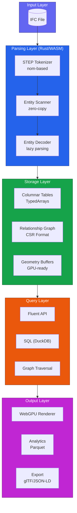
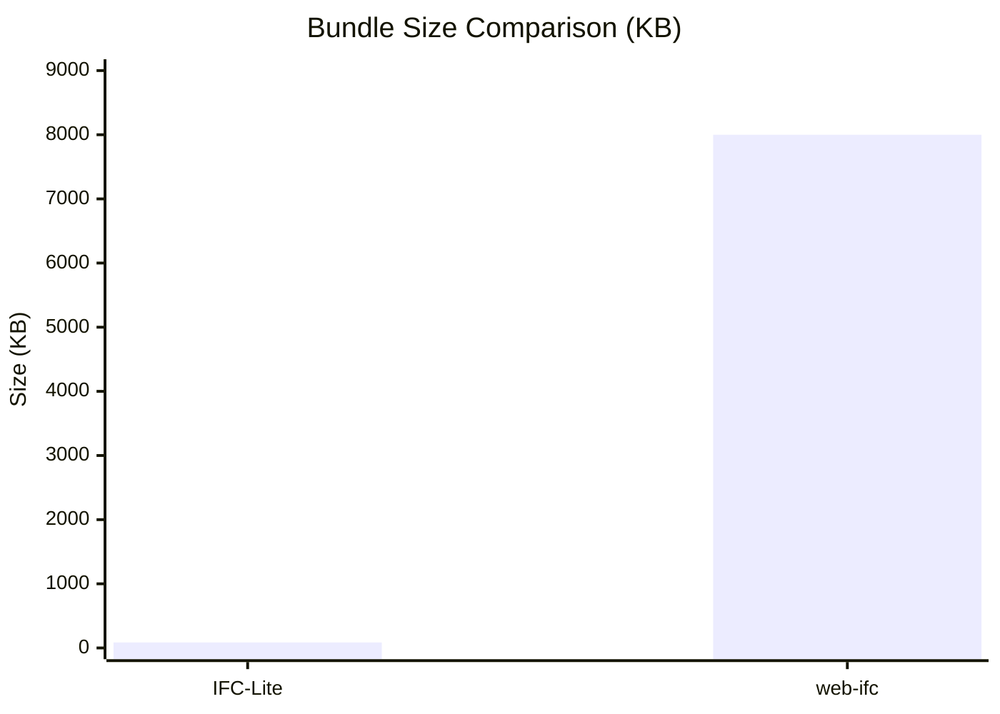

# IFC-Lite Documentation

<div class="grid cards" markdown>

-   :material-rocket-launch:{ .lg .middle } __Get Started Quickly__

    ---

    Install IFC-Lite and parse your first IFC file in under 5 minutes.

    [:octicons-arrow-right-24: Quick Start](guide/quickstart.md)

-   :material-book-open-variant:{ .lg .middle } __User Guide__

    ---

    Learn how to use all features of IFC-Lite for parsing, geometry, and rendering.

    [:octicons-arrow-right-24: User Guide](guide/parsing.md)

-   :material-cog:{ .lg .middle } __Architecture__

    ---

    Understand the system design and how data flows through IFC-Lite.

    [:octicons-arrow-right-24: Architecture](architecture/overview.md)

-   :material-api:{ .lg .middle } __API Reference__

    ---

    Complete API documentation for TypeScript and Rust.

    [:octicons-arrow-right-24: API Reference](api/typescript.md)

</div>

## What is IFC-Lite?

**IFC-Lite** is a high-performance, browser-native IFC (Industry Foundation Classes) platform. It provides:

- **Fast Parsing**: Zero-copy STEP tokenization at ~1,259 MB/s
- **Streaming Geometry**: Progressive mesh processing with first triangles in 300-500ms
- **WebGPU Rendering**: Modern GPU-accelerated 3D visualization
- **Tiny Bundle**: Only ~86 KB total (93% smaller than alternatives)
- **Full Schema Support**: 100% IFC4 coverage (776 entities)

## System Overview



## Quick Example

=== "TypeScript"

    ```typescript
    import { IfcParser } from '@ifc-lite/parser';
    import { Renderer } from '@ifc-lite/renderer';

    // Parse IFC file
    const parser = new IfcParser();
    const file = await fetch('model.ifc').then(r => r.arrayBuffer());
    const result = await parser.parse(file);

    // Query entities
    const walls = result.entities.filter(e => e.type === 'IFCWALL');
    console.log(`Found ${walls.length} walls`);

    // Render geometry
    const canvas = document.getElementById('viewer');
    const renderer = new Renderer(canvas);
    await renderer.loadGeometry(result.geometry);
    renderer.render();
    ```

=== "Rust"

    ```rust
    use ifc_lite_core::{parse_stream, StreamConfig, ParseEvent};

    // Parse IFC file
    let content = std::fs::read_to_string("model.ifc")?;
    let config = StreamConfig::default();

    // Stream parse events
    for event in parse_stream(&content, config) {
        match event {
            ParseEvent::Entity { id, type_name, .. } => {
                println!("Entity #{}: {}", id, type_name);
            }
            ParseEvent::Progress { percent } => {
                println!("Progress: {}%", percent);
            }
            _ => {}
        }
    }
    ```

## Key Features

| Feature | Description |
|---------|-------------|
| **Zero-Copy Parsing** | Direct memory access without data copying |
| **Streaming Pipeline** | Progressive geometry processing |
| **WebGPU Rendering** | Modern GPU acceleration |
| **Columnar Storage** | Memory-efficient TypedArray storage |
| **Full IFC4 Schema** | 776 entities, 397 types, 207 enums |
| **Cross-Platform** | Browser, Node.js, and native Rust |

## Performance Comparison



## Browser Support

| Browser | Version | WebGPU |
|---------|---------|--------|
| Chrome | 113+ | :material-check: |
| Edge | 113+ | :material-check: |
| Firefox | 127+ | :material-check: |
| Safari | 18+ | :material-check: |

## Next Steps

<div class="grid cards" markdown>

-   [:material-download: __Installation__](guide/installation.md)

    Install IFC-Lite in your project

-   [:material-play: __Quick Start__](guide/quickstart.md)

    Parse your first IFC file

-   [:material-school: __Tutorials__](tutorials/building-viewer.md)

    Build a complete IFC viewer

-   [:material-github: __Source Code__](https://github.com/louistrue/ifc-lite)

    View on GitHub

</div>

