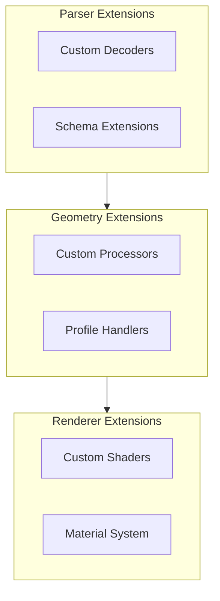

# Extending the Parser

Learn to extend IFC-Lite with custom functionality.

## Extension Points



## Custom Entity Decoders

### Creating a Decoder

```typescript
import { EntityDecoder, DecodedEntity } from '@ifc-lite/parser';

// Define custom entity interface
interface CustomDoorData {
  expressId: number;
  globalId: string;
  name: string;
  width: number;
  height: number;
  isExternal: boolean;
  fireRating: number;
}

// Create custom decoder
class DoorDecoder {
  constructor(private parser: ParseResult) {}

  decode(entity: DecodedEntity): CustomDoorData {
    const props = this.parser.getPropertySets(entity.expressId);
    const quantities = this.parser.getQuantities(entity.expressId);

    return {
      expressId: entity.expressId,
      globalId: entity.globalId,
      name: entity.name || 'Unknown Door',
      width: quantities?.Width?.value || 0,
      height: quantities?.Height?.value || 0,
      isExternal: props?.['Pset_DoorCommon']?.IsExternal || false,
      fireRating: props?.['Pset_DoorCommon']?.FireRating || 0
    };
  }

  decodeAll(): CustomDoorData[] {
    return this.parser.entities
      .filter(e => e.type === 'IFCDOOR')
      .map(e => this.decode(e));
  }
}

// Usage
const doorDecoder = new DoorDecoder(parseResult);
const doors = doorDecoder.decodeAll();
```

### Streaming Decoder

```typescript
class StreamingDecoder<T> {
  private handlers = new Map<string, (entity: Entity) => T>();

  register(type: string, handler: (entity: Entity) => T): void {
    this.handlers.set(type, handler);
  }

  async *decode(
    parser: IfcParser,
    buffer: ArrayBuffer
  ): AsyncGenerator<T> {
    for await (const batch of parser.parseStreaming(buffer)) {
      for (const entity of batch.entities) {
        const handler = this.handlers.get(entity.type);
        if (handler) {
          yield handler(entity);
        }
      }
    }
  }
}

// Usage
const decoder = new StreamingDecoder<CustomDoorData>();
decoder.register('IFCDOOR', (entity) => ({
  expressId: entity.expressId,
  // ... decode door
}));

for await (const door of decoder.decode(parser, buffer)) {
  console.log(door);
}
```

## Custom Geometry Processors

### Processor Interface

```typescript
import { GeometryProcessor, Mesh, Entity } from '@ifc-lite/geometry';

interface ProcessorContext {
  decoder: EntityDecoder;
  quality: 'FAST' | 'BALANCED' | 'HIGH';
}

abstract class GeometryProcessor {
  abstract canProcess(entity: Entity): boolean;
  abstract process(entity: Entity, context: ProcessorContext): Mesh | null;
}
```

### Example: Custom Profile Processor

```typescript
class CustomProfileProcessor extends GeometryProcessor {
  canProcess(entity: Entity): boolean {
    // Handle custom profile types
    return entity.type === 'IFCARBITRARYCLOSEDPROFILEDEF' &&
           this.hasCustomAttributes(entity);
  }

  process(entity: Entity, context: ProcessorContext): Mesh | null {
    const profile = this.extractProfile(entity, context.decoder);

    // Custom triangulation logic
    const points = this.convertToPoints(profile);
    const indices = this.triangulate(points);

    // Build mesh
    return this.buildMesh(entity.expressId, points, indices);
  }

  private extractProfile(entity: Entity, decoder: EntityDecoder): Point2[] {
    // Custom profile extraction
    const curve = decoder.decode(entity.attributes[0].value);
    return this.curveToPoints(curve);
  }

  private triangulate(points: Point2[]): number[] {
    // Use earcut or custom algorithm
    return earcut(points.flat(), [], 2);
  }
}
```

### Registering Custom Processors

```typescript
import { GeometryRouter, ProcessorRegistry } from '@ifc-lite/geometry';

// Register globally
ProcessorRegistry.register(new CustomProfileProcessor());

// Or per-instance
const router = new GeometryRouter();
router.addProcessor(new CustomProfileProcessor());

// Process geometry with custom processors
const result = await parser.parse(buffer, {
  geometryRouter: router
});
```

## Schema Extensions

### Adding Custom Entity Types

```typescript
import { SchemaRegistry, EntityDefinition } from '@ifc-lite/parser';

// Define custom entity
const customEntity: EntityDefinition = {
  name: 'IFCCUSTOMELEMENT',
  parent: 'IFCBUILDINGELEMENT',
  attributes: [
    { name: 'CustomProperty', type: 'STRING', optional: true },
    { name: 'CustomValue', type: 'REAL', optional: true }
  ]
};

// Register
SchemaRegistry.register(customEntity);

// Now parser will recognize custom entities
const result = await parser.parse(buffer);
const customs = result.entities.filter(e => e.type === 'IFCCUSTOMELEMENT');
```

### Custom Property Extractors

```typescript
import { PropertyExtractor } from '@ifc-lite/parser';

class CustomPropertyExtractor extends PropertyExtractor {
  extract(entity: Entity, decoder: EntityDecoder): Record<string, any> {
    const base = super.extract(entity, decoder);

    // Add custom properties
    if (entity.type === 'IFCWALL') {
      base.customProperty = this.computeCustomProperty(entity);
    }

    return base;
  }

  private computeCustomProperty(entity: Entity): number {
    // Custom calculation
    return 42;
  }
}
```

## Renderer Extensions

### Custom Shaders

```typescript
import { Renderer, ShaderModule } from '@ifc-lite/renderer';

const customVertexShader = `
  struct Uniforms {
    viewProjection: mat4x4<f32>,
    model: mat4x4<f32>,
    customParam: f32,
  }

  @group(0) @binding(0) var<uniform> uniforms: Uniforms;

  @vertex
  fn main(@location(0) position: vec3<f32>) -> @builtin(position) vec4<f32> {
    // Custom vertex transformation
    let modified = position * uniforms.customParam;
    return uniforms.viewProjection * uniforms.model * vec4(modified, 1.0);
  }
`;

const customFragmentShader = `
  @fragment
  fn main() -> @location(0) vec4<f32> {
    // Custom fragment coloring
    return vec4(1.0, 0.0, 0.0, 1.0);
  }
`;

// Create custom pipeline
const renderer = new Renderer(canvas);
renderer.registerShader('custom', {
  vertex: customVertexShader,
  fragment: customFragmentShader
});

// Use for specific entities
renderer.setShader(entityIds, 'custom');
```

### Custom Material System

```typescript
interface CustomMaterial {
  baseColor: [number, number, number, number];
  metallic: number;
  roughness: number;
  emission: [number, number, number];
}

class MaterialManager {
  private materials = new Map<number, CustomMaterial>();

  setMaterial(expressId: number, material: CustomMaterial): void {
    this.materials.set(expressId, material);
  }

  getMaterial(expressId: number): CustomMaterial | undefined {
    return this.materials.get(expressId);
  }

  applyToRenderer(renderer: Renderer): void {
    for (const [expressId, material] of this.materials) {
      renderer.setColor(expressId, material.baseColor);
      // Apply additional material properties via uniforms
    }
  }
}
```

## Plugin System

### Creating a Plugin

```typescript
interface IfcLitePlugin {
  name: string;
  version: string;

  // Lifecycle hooks
  onInit?(context: PluginContext): void;
  onParse?(result: ParseResult): void;
  onGeometry?(meshes: Mesh[]): void;
  onRender?(renderer: Renderer): void;
  onDispose?(): void;
}

interface PluginContext {
  parser: IfcParser;
  renderer: Renderer;
  query: IfcQuery;
}

// Example plugin
class AnalyticsPlugin implements IfcLitePlugin {
  name = 'analytics';
  version = '1.0.0';

  onParse(result: ParseResult): void {
    console.log('Parse statistics:', {
      entities: result.entityCount,
      schema: result.schema,
      types: this.countTypes(result)
    });
  }

  private countTypes(result: ParseResult): Record<string, number> {
    const counts: Record<string, number> = {};
    for (const entity of result.entities) {
      counts[entity.type] = (counts[entity.type] || 0) + 1;
    }
    return counts;
  }
}
```

### Plugin Manager

```typescript
class PluginManager {
  private plugins: IfcLitePlugin[] = [];

  register(plugin: IfcLitePlugin): void {
    this.plugins.push(plugin);
    console.log(`Registered plugin: ${plugin.name} v${plugin.version}`);
  }

  async init(context: PluginContext): Promise<void> {
    for (const plugin of this.plugins) {
      await plugin.onInit?.(context);
    }
  }

  onParse(result: ParseResult): void {
    for (const plugin of this.plugins) {
      plugin.onParse?.(result);
    }
  }

  // ... other lifecycle methods
}

// Usage
const plugins = new PluginManager();
plugins.register(new AnalyticsPlugin());

const result = await parser.parse(buffer);
plugins.onParse(result);
```

## Best Practices

### 1. Keep Extensions Focused

```typescript
// Good: Single responsibility
class FireRatingExtractor {
  extract(entity: Entity): number | null { ... }
}

// Bad: Too many responsibilities
class EverythingExtractor {
  extractFireRating(entity: Entity): number { ... }
  extractMaterials(entity: Entity): Material[] { ... }
  triangulateGeometry(entity: Entity): Mesh { ... }
  // ...
}
```

### 2. Use TypeScript Generics

```typescript
class TypedDecoder<T> {
  constructor(
    private decode: (entity: Entity) => T
  ) {}

  decodeAll(entities: Entity[]): T[] {
    return entities.map(this.decode);
  }
}

const doorDecoder = new TypedDecoder<CustomDoorData>(decodeDoor);
```

### 3. Handle Errors Gracefully

```typescript
class SafeProcessor extends GeometryProcessor {
  process(entity: Entity, context: ProcessorContext): Mesh | null {
    try {
      return this.doProcess(entity, context);
    } catch (error) {
      console.warn(`Failed to process ${entity.type} #${entity.expressId}:`, error);
      return null; // Return null instead of throwing
    }
  }
}
```

## Next Steps

- [API Reference](../api/typescript.md) - Full API documentation
- [Architecture](../architecture/overview.md) - System design
